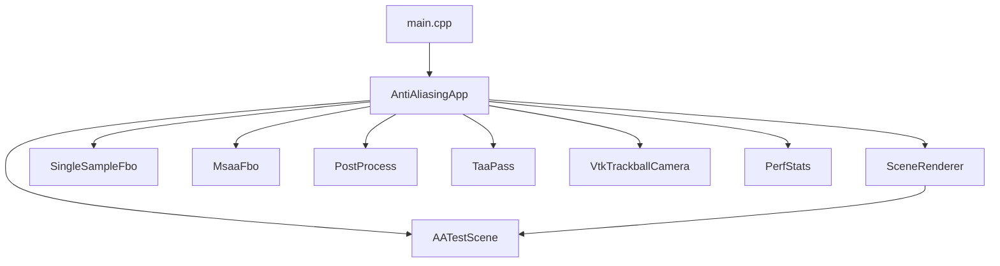
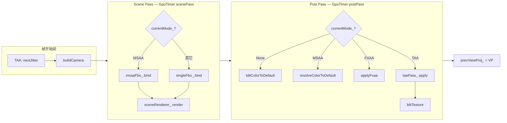

# OpenGL_Anti_Aliasing 代码导读

> 本文档面向「想顺着代码把逻辑走通」的读者。  
> 源码地址：[GitHub 仓库](https://github.com/HalCG/OpenGLInstance/tree/main/OpenGL_Anti_Aliasing)  
> **设计、实现与问答全文：** [`Anti_Aliasing_博客.md`](Anti_Aliasing_博客.md)（含附录：对比表、观察指南、常见坑）  
> **问题快速检索：** [`Anti_Aliasing_问答索引.md`](Anti_Aliasing_问答索引.md)  
> 建议：**先通读博客或本文第 1～4 节建立地图，再按第 9 节推荐阅读顺序打开源码。**

---

## 1. 这个项目在做什么

这是一个 **四种抗锯齿方案对比 Demo**，在同一场景、同一套前向渲染管线下，运行时切换：

| 模式 | 按键 | 核心思路 |
|------|------|----------|
| None | `1` | 无 AA，离屏渲染后 blit 到屏幕 |
| MSAA | `2` | 硬件多重采样 FBO，resolve 到屏幕 |
| FXAA | `3` | 全屏后处理，按亮度边缘模糊 |
| TAA | `4` | 子像素抖动 + 历史帧重投影混合 |

**设计原则：**

1. **Scene Pass 统一**：四种模式都先画到离屏 FBO（MSAA 用 multisample FBO，其余用单采样 FBO）。
2. **Post Pass 分支**：`currentMode_` 决定如何把离屏结果送到默认 framebuffer（窗口）。
3. **事件驱动主循环**：平时 `glfwWaitEvents` 省电；有输入或 TAA 持续出帧时才 `poll + render + swap`。

---

## 2. 目录与职责一览

```
OpenGL_Anti_Aliasing/
├── main.cpp                    # 入口：init → run → shutdown
├── include/
│   ├── AntiAliasingApp.hpp     # 应用总控：状态、主循环、输入回调
│   ├── AppConfig.hpp           # 窗口/相机/MSAA 等常量，资源路径
│   ├── RenderTypes.hpp         # AAMode、FrameCamera、FrameStats
│   ├── VtkTrackballCamera.hpp  # 轨道球相机（yaw/pitch/radius）
│   ├── AATestScene.hpp         # 测试场景声明
│   ├── SceneRenderer.hpp       # 场景绘制（scene + line shader）
│   ├── Framebuffer.hpp         # SingleSampleFbo / MsaaFbo
│   ├── PostProcess.hpp         # blit / FXAA 全屏 pass
│   ├── TaaPass.hpp             # TAA 后处理 + history ping-pong
│   ├── PerfStats.hpp           # GPU pass 计时 + CPU 帧时间/FPS
│   ├── Shader.hpp / Mesh.hpp / Model.hpp  # 通用渲染工具
│   └── TextOverlay.hpp         # （当前未接入主流程，可忽略）
├── src/                        # 与 include 同名实现
└── resources/
    ├── shaders/                # scene / line / fxaa / taa / blit / fullscreen
    └── models/spot/            # spot.obj + spot.png
```

**运行时资源路径：** 构建后 CMake 会把 `OpenGL_Anti_Aliasing/resources/` 复制到 exe 旁的 `resources/`。  
代码里 `AppConfig::resourcePath("shaders/...")` 解析为 `resources/shaders/...`，要求 **进程工作目录在 exe 目录**（CMake 已设置 `VS_DEBUGGER_WORKING_DIRECTORY`）。

---

## 3. 架构总图

### 3.1 模块依赖



### 3.2 一帧渲染管线（`renderFrame`）



**关键：** `currentMode_` 在 **Scene** 和 **Post** 两处各分支一次，但 Scene 内容相同，差异在 FBO 类型与 Post 处理方式。

---

## 4. 程序生命周期与时序

### 4.1 启动链（`main` → `init`）

```
main()
  └─ AntiAliasingApp::init()
       ├─ initWindow()          GLFW + GLAD + 注册回调
       ├─ scene_.init()         加载模型、生成地板/细线/细条
       ├─ sceneRenderer_.init()
       ├─ postProcess_.init()
       ├─ taaPass_.init()
       ├─ perf_.scenePass/postPass.init()
       └─ resizeTargets()      按窗口尺寸创建 FBO / TAA history
```

对应文件：`main.cpp`、`AntiAliasingApp.cpp` 第 43～61 行。

### 4.2 主循环（`run`）

```cpp
while (!glfwWindowShouldClose) {
    continuousRender = (currentMode_ == TAA);   // 仅 TAA 每帧都画
    active = cameraDirty_ || continuousRender || camera_.isDragging();

    if (active)  glfwPollEvents();   // 有事情：轮询输入
    else         glfwWaitEvents();   // 空闲：阻塞等事件

    if (cameraDirty_ || continuousRender) {
        renderFrame();
        glfwSwapBuffers();
        if (!continuousRender) cameraDirty_ = false;
    }
}
```

**为什么要这样设计？**

| 机制 | 作用 |
|------|------|
| `cameraDirty_` | 输入/resize/切模式后置 true，触发重绘一帧 |
| `continuousRender`（TAA） | 时间抗锯齿需要每帧新 jitter + history 累积，不能「画一帧就停」 |
| `isDragging()` 时仍 poll | 拖拽中即使 dirty 已被清掉，也要持续收鼠标事件 |
| 先 poll 再 render | 减少相机响应滞后一帧 |

**阅读位置：** `AntiAliasingApp.cpp` 第 198～225 行。

### 4.3 单帧内部时序（`renderFrame`）

按执行顺序：

| 步骤 | 代码位置 | 做什么 |
|------|----------|--------|
| 1 | `perf_.beginFrame()` | 记录 CPU 帧起点时间 |
| 2 | TAA 时 `nextJitter` | Halton 序列生成子像素偏移 |
| 3 | `buildCamera(jitter)` | 组装 view / projection / VP / invVP |
| 4 | `scenePass.begin()` | 开始 GPU 计时 |
| 5 | 绑定 FBO + clear + `sceneRenderer_.render` | 3D 场景画到离屏 |
| 6 | `scenePass.endMs()` | 写入 `scenePassMs` |
| 7 | `postPass.begin()` | Post GPU 计时 |
| 8 | `switch(currentMode_)` | None/MSAA/FXAA/TAA 出屏 |
| 9 | `postPass.endMs()` | 写入 `postPassMs` |
| 10 | 保存 `prevViewProj_` | 供下一帧 TAA 重投影 |
| 11 | `perf_.endFrame()` | CPU 帧时间 + 平滑 FPS |
| 12 | 每 15 帧更新窗口标题 | 拖拽时跳过，减开销 |

**阅读位置：** `AntiAliasingApp.cpp` 第 131～196 行。

---

## 5. 核心状态变量（读懂 `AntiAliasingApp.hpp`）

这些成员决定「何时画、画什么、怎么画」：

| 变量 | 类型 | 含义 |
|------|------|------|
| `currentMode_` | `AAMode` | **主开关**：Scene 用哪个 FBO、Post 走哪条分支 |
| `msaaPresetIndex_` | `int` | MSAA 2x/4x（`[` `]` 切换） |
| `camera_` | `VtkTrackballCamera` | 轨道球参数（yaw/pitch/radius/target） |
| `cameraDirty_` | `bool` | 是否需要 render+swap |
| `prevViewProj_` | `mat4` | 上一帧 view×projection，TAA 重投影用 |
| `hasPrevViewProj_` | `bool` | 首帧、resize、切模式后为 false，TAA 不混 history |
| `width_` / `height_` | `uint` | 窗口尺寸，FBO 与 jitter 依赖 |
| `singleFbo_` | `SingleSampleFbo` | None / FXAA / TAA 的 scene 输出 |
| `msaaFbo_` | `MsaaFbo` | MSAA 的 scene 输出 |
| `taaPass_` | `TaaPass` | TAA history + shader |
| `postProcess_` | `PostProcess` | blit / FXAA |
| `perf_` | `PerfStats` | 性能统计 |

**静态 `s_instance_`：** GLFW 回调是 C 函数指针，无法带 `this`，故用单例指针在回调里访问 `AntiAliasingApp`。

---

## 6. 分模块详解

### 6.1 `AntiAliasingApp` — 总控

**职责：** 窗口、输入、模式切换、调度 `renderFrame`、管理所有子模块生命周期。

#### `buildCamera` — 相机矩阵组装

```cpp
camera.view = camera_.viewMatrix();
camera.projection = glm::perspective(...);
if (currentMode_ == TAA) {
    camera.projection[2][0] += jitterNdc.x * 2.0f;  // 子像素抖动
    camera.projection[2][1] += jitterNdc.y * 2.0f;
}
camera.viewProjection = projection * view;
camera.invViewProjection = inverse(viewProjection);
```

TAA 的 jitter 加在 **projection 矩阵第 3 列**（透视投影的 x/y 偏移项），使每帧采样位置在像素内轻微变化。

#### 输入回调链

```
鼠标按下/移动/滚轮/按键
  → markCameraDirty()（或 TAA 相关 reset）
  → 下一帧 run() 里 renderFrame()
```

**Resize 特殊处理**（`framebufferSizeCallback`）：

1. 更新 `width_` / `height_`
2. `resizeTargets()` 重建所有 FBO
3. `taaPass_.resetHistory()` + `hasPrevViewProj_ = false`（避免旧分辨率 history 鬼影）

**切模式**（`keyCallback` 1～4）：更新 `currentMode_`，离开 TAA 或进 TAA 都 `resetHistory()`；MSAA 还会 `resizeTargets()` 刷新 sample 数。

---

### 6.2 `VtkTrackballCamera` — 轨道球相机

**状态：** `target`（观察中心）、`yaw`、`pitch`、`radius`（轨道距离）。

| 输入 | 方法 | 效果 |
|------|------|------|
| 左键拖拽 | `applyCursorDelta` Rotate | 改 yaw/pitch |
| 中键拖拽 | Pan | 平移 target |
| 右键拖拽 | Dolly | 改 radius |
| 滚轮 | `applyScroll` | 缩放 radius |

`skipDragDelta`：按下鼠标的第一帧不应用位移，防止光标跳变。

`isDragging()`：主循环用来决定 poll 还是 wait；`PerfStats` 拖拽时关闭 GPU query 减卡顿。

---

### 6.3 `AATestScene` — 为什么这样搭场景

专为 **观察锯齿** 设计：

| 元素 | 目的 |
|------|------|
| 4 个 spot 实例 | 几何轮廓、遮挡边缘 |
| Checker 地板 | 高频纹理 alias（MSAA 帮助有限） |
| `thinQuads_` 细竖条 | 亚像素级几何边缘 |
| `gridLines_`（GL_LINES） | 1px 级线条锯齿，None 下最明显 |

绘制分两路：

- `drawOpaque`：地板 + 细条 + spot（`scene.frag`）
- `drawLines`：网格线（`line.frag`，通常线宽 1px）

---

### 6.4 `SceneRenderer` — Scene Pass 的唯一绘制入口

```cpp
sceneShader_: scene.vert + scene.frag  → drawOpaque
lineShader_:  line.vert  + line.frag   → drawLines
```

统一设置 `view`、`projection`、光源、材质系数，再委托 `AATestScene` 绘制。  
**四种 AA 模式共用这一 pass**，保证对比公平。

---

### 6.5 `Framebuffer` — 离屏目标

#### `SingleSampleFbo`（None / FXAA / TAA）

- **Color：** `RGBA8` 纹理 → `colorTexture()`
- **Depth：** `DEPTH_COMPONENT32F` 纹理 → `depthTexture()`（**TAA 重投影必需**）
- **出屏：** `blitColorToDefault()` — `glBlitFramebuffer` 到默认 FBO

#### `MsaaFbo`（MSAA）

- **Color / Depth：** `GL_TEXTURE_2D_MULTISAMPLE`
- Scene 时 `glEnable(GL_MULTISAMPLE)`
- **出屏：** `resolveColorToDefault()` — blit 时自动 resolve 多重采样

**为何不用窗口默认 FBO 做 MSAA？**  
窗口 `GLFW_SAMPLES` 在 `initWindow` 里设为 0；所有 AA 状态在 **独立离屏 FBO** 切换，避免与 FXAA/TAA 纠缠。

---

### 6.6 `PostProcess` — 全屏后处理

共用资源：

- 全屏 quad VAO（4 顶点，`GL_TRIANGLE_FAN` 画两个三角形铺满 NDC）
- `fullscreen.vert`：直接输出 `gl_Position = vec4(aPos,0,1)` 与 UV

| 方法 | Shader | 作用 |
|------|--------|------|
| `blitTexture` | `blit.frag` | 纹理原样采样到默认 FBO |
| `applyFxaa` | `fxaa.frag` | 亮度边缘检测 + 方向混合 |
| `resolveMsaaToScreen` | （无 shader） | 与 `MsaaFbo` 的 blit resolve 类似 |

`drawFullscreen()` = `glDrawArrays(GL_TRIANGLE_FAN, 0, 4)`。

---

### 6.7 `TaaPass` — 时间抗锯齿（重点）

分三块：**抖动采样**、**history 管理**、**全屏混合 shader**。

#### A. `nextJitter` — Halton 子像素偏移

```cpp
jx = halton((frameIndex % 16) + 1, 2) - 0.5f;
jy = halton((frameIndex % 16) + 1, 3) - 0.5f;
return vec2(jx/width, jy/height);  // 像素单位 → 传给 buildCamera
```

16 帧循环的低差异序列，比随机分布更均匀。

#### B. History ping-pong

- `history_[0]`、`history_[1]`：两张 `RGBA16F` 纹理
- `apply()` 里：`writeIndex = 1 - currentIndex_`，写入新结果，从 `readIndex` 读上一帧
- `resetHistory()`：`validHistory_ = false`，shader 里 `uHasHistory=0` 时直接输出 current

#### C. `apply()` 绑定的纹理与矩阵

| Uniform | 来源 |
|---------|------|
| `uCurrentColor` | `singleFbo_.colorTexture()` |
| `uCurrentDepth` | `singleFbo_.depthTexture()` |
| `uHistoryColor` | `history_[readIndex]` |
| `uInvViewProj` | 当前帧 `camera.invViewProjection` |
| `uPrevViewProj` | 上一帧 `prevViewProj_` |
| `uBlendFactor` | 固定 `0.1`（10% 新帧 + 90% history） |

#### D. `taa.frag` 逻辑（建议对照阅读）

```
1. 采样 current 颜色
2. 若无 history → 输出 current
3. reprojectHistory:
   uv + depth → 世界坐标 → 上一帧屏幕 uv → 采样 history
4. 若重投影 uv 出屏 → 输出 current
5. clipHistory: 用 current 的 3×3 邻域 min/max clamp history（减 ghosting）
6. mix(history, current, 0.1)
```

**本 Demo 未使用 per-object motion vector**，动态物体鬼影靠 neighborhood clamp 缓解。

---

### 6.8 `PerfStats` — 两套计时

| 指标 | 测量方式 | 含义 |
|------|----------|------|
| `scenePassMs` / `postPassMs` | `GL_TIME_ELAPSED` query（双缓冲 query 防 stall） | GPU 上该 pass 耗时 |
| `totalFrameMs` / `fps` | `glfwGetTime()` 在 begin/endFrame | CPU 侧整段 renderFrame 墙钟时间 |

拖拽时 `setEnabled(false)` 关闭 GPU query，减轻交互卡顿。  
FPS 用指数平滑：`smoothed = 0.9*old + 0.1*instant`，标题栏数字不会狂跳。

---

## 7. 四种模式代码路径对照

### None（`AAMode::None`）

```
Scene → singleFbo_
Post  → singleFbo_.blitColorToDefault()
```

文件：`Framebuffer.cpp` `blitColorToDefault`。

### MSAA（`AAMode::MSAA`）

```
Scene → msaaFbo_（glEnable GL_MULTISAMPLE）
Post  → msaaFbo_.resolveColorToDefault()
```

`[` `]` → `msaaPresetIndex_` → `resizeTargets()` → `clampMsaaSamples` 限制在 `GL_MAX_SAMPLES`。

### FXAA（`AAMode::FXAA`）

```
Scene → singleFbo_
Post  → postProcess_.applyFxaa(colorTexture)
```

Shader 核心：比较当前像素与上下左右亮度的二阶差，判水平/垂直边缘，沿边缘方向混合邻域颜色。

### TAA（`AAMode::TAA`）

```
每帧: nextJitter → buildCamera(带 jitter)
Scene → singleFbo_（抖动后的 VP）
Post  → taaPass_.apply(color, depth, camera, prevViewProj, hasPrevViewProj)
     → postProcess_.blitTexture(taaPass_.outputTexture())
帧末: prevViewProj_ = camera.viewProjection
```

主循环 **持续出帧**（`continuousRender`），与另外三种模式的「事件驱动画一帧」不同。

---

## 8. 常见问题（读代码时容易卡住的点）

### Q1：`cameraDirty_` 和 TAA 的 `continuousRender` 区别？

- `cameraDirty_`：一般模式「画一帧就清 false，停住等下次输入」。
- TAA：`continuousRender` 为 true 时 **不清 dirty**，每帧都 `renderFrame`，用于累积抗锯齿。

### Q2：为什么 TAA 要 depth 纹理？

重投影需要知道「这个像素对应 3D 空间哪一点」，必须读 depth 反算世界坐标，再投到上一帧屏幕。

### Q3：`hasPrevViewProj_` 和 `taaPass_.validHistory_` 两套标志？

- `hasPrevViewProj_`：App 层，首帧/resize/切模式后没有有效上一帧 VP。
- `validHistory_`：TaaPass 层，history 纹理是否已有有效内容。  
`apply()` 里 `uHasHistory = hasHistory && validHistory_`。

### Q4：工作目录不对会怎样？

找不到 `resources/shaders/...`，shader 编译失败或模型加载失败。请从构建输出目录运行 exe，或用 IDE 任务（已配置 working directory）。

### Q5：`TextOverlay.cpp` 有用吗？

当前 **未在 `AntiAliasingApp` 中调用**；性能信息走 **窗口标题** `glfwSetWindowTitle`。读主流程可跳过。

---

## 9. 推荐阅读顺序（顺着文档看代码）

按下面顺序打开文件，每步对照本文对应章节：

| 顺序 | 文件 | 关注什么 |
|------|------|----------|
| ① | `main.cpp` | 三步生命周期 |
| ② | `include/RenderTypes.hpp` | `AAMode`、`FrameCamera` 字段含义 |
| ③ | `include/AntiAliasingApp.hpp` | 成员变量地图（第 5 节） |
| ④ | `src/AntiAliasingApp.cpp` → `run()` | 主循环与事件驱动 |
| ⑤ | 同文件 → `renderFrame()` | **整项目心脏**，Scene/Post 分支 |
| ⑥ | `include/VtkTrackballCamera.hpp` | 输入如何变成 view 矩阵 |
| ⑦ | `src/AATestScene.cpp` | 场景里有什么、为什么 |
| ⑧ | `src/SceneRenderer.cpp` | Scene Pass 绘制 |
| ⑨ | `src/Framebuffer.cpp` | 两种 FBO 创建与 blit/resolve |
| ⑩ | `src/PostProcess.cpp` | 全屏 quad + FXAA/blit |
| ⑪ | `src/TaaPass.cpp` + `resources/shaders/taa.frag` | TAA 完整链路 |
| ⑫ | `resources/shaders/fxaa.frag` | FXAA 边缘检测 |
| ⑬ | `src/PerfStats.cpp` | 性能数字从哪来 |
| ⑭ | `include/AppConfig.hpp` | 调参入口 |

**第一次精读建议只跟一条模式路径：**

1. 先按 **None** 走通：`renderFrame` 里 Scene → `blitColorToDefault`。
2. 再切 **FXAA**，只看 Post 分支变化。
3. 再 **MSAA**，看 FBO 绑定变化。
4. 最后 **TAA**，加上 `nextJitter`、`taa.frag`、主循环 `continuousRender`。

---

## 10. 一帧数据流（TAA 模式完整示例）

```
[输入] 鼠标移动 → markCameraDirty（TAA 下本来就会每帧画）

[run]
  pollEvents
  renderFrame:
    jitter = Halton(frameIndex)
    camera = buildCamera(jitter)     // projection 含偏移
    ── Scene Pass ──
    bind singleFbo_
    clear
    sceneRenderer → spot/floor/lines → colorTex + depthTex
    ── Post Pass ──
    taaPass.apply(color, depth, camera, prevVP, hasHistory)
      → fullscreen shader: reproject + clamp + mix
      → 写入 history[write]
    blitTexture(history output) → 默认 framebuffer
    prevViewProj_ = camera.VP
  swapBuffers
```

---

## 11. 构建与运行

```bash
cmake --preset x64-clang-debug
cmake --build out/build/x64-clang-debug --target OpenGL_Anti_Aliasing
```

可执行文件：

`out/build/x64-clang-debug/OpenGL_Anti_Aliasing/OpenGL_Anti_Aliasing.exe`

同目录下应有 `resources/`（CMake POST_BUILD 从 `OpenGL_Anti_Aliasing/resources` 复制）。

### 按键速查

| 按键 | 功能 |
|------|------|
| `1`～`4` / `F1`～`F4` | None / MSAA / FXAA / TAA |
| `[` `]` | MSAA 2x ↔ 4x |
| LMB / MMB / RMB | 旋转 / 平移 / 缩放 |
| 滚轮 | 缩放 |
| `ESC` | 退出 |

---

## 12. 与其它文档的分工

| 文档 | 内容 |
|------|------|
| **Anti_Aliasing_博客.md** | 设计、四种模式实现、问答集锦、附录（对比表/观察指南/常见坑） |
| **本文（代码导读）** | 架构、时序、状态机、文件职责、阅读路线 |
| **Anti_Aliasing_问答索引.md** | 学习问题 → 博客章节 / 源码行号 |

建议：**博客或本文走通代码 → 博客附录做对比实验 → 问答索引查具体问题 → 回到代码改参数**（如 TAA `uBlendFactor`、MSAA sample 数）。

---

*文档版本：与 `OpenGL_Anti_Aliasing` 源码同步（resources 位于项目目录 `OpenGL_Anti_Aliasing/resources/`）。*
