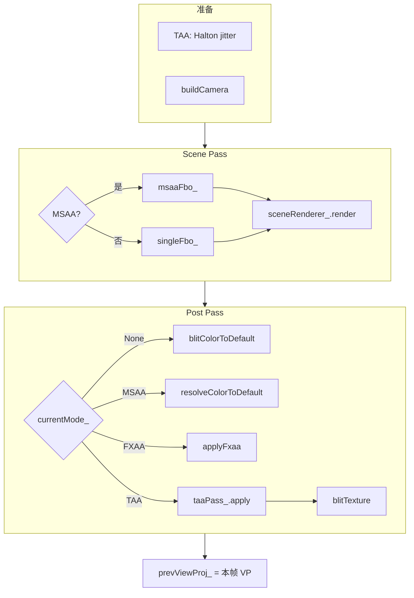

# OpenGL 抗锯齿对比 Demo：设计、实现与深度问答

> 子项目：`OpenGL_Anti_Aliasing`  
> 源码地址：[GitHub 仓库](https://github.com/HalCG/OpenGLInstance/tree/main/OpenGL_Anti_Aliasing)  
> 本文是一篇 **可独立阅读的技术博客**，涵盖架构设计、四种 AA 模式实现、关键代码路径，并融合近期学习与调试中的 **常见问题与解答**。  
> 配套文档：[代码导读](Anti_Aliasing_代码导读.md)（按文件读代码）、[问答索引](Anti_Aliasing_问答索引.md)（问题快速检索）。原理对比表、观察指南见本文 [附录](#13-附录)。

---

## 目录

1. [项目动机与设计目标](#1-项目动机与设计目标)
2. [总体架构](#2-总体架构)
3. [测试场景：为什么这样搭](#3-测试场景为什么这样搭)
4. [渲染管线：Scene Pass 与 Post Pass](#4-渲染管线scene-pass-与-post-pass)
5. [四种抗锯齿模式](#5-四种抗锯齿模式)
6. [离屏 FBO 设计](#6-离屏-fbo-设计)
7. [FXAA：后处理抗锯齿](#7-fxaa后处理抗锯齿)
8. [TAA：时间抗锯齿（重点）](#8-taa时间抗锯齿重点)
9. [性能统计与主循环策略](#9-性能统计与主循环策略)
10. [状态机与边界情况](#10-状态机与边界情况)
11. [问答集锦（学习过程中整理）](#11-问答集锦学习过程中整理)
12. [源码阅读路线与构建](#12-源码阅读路线与构建)
13. [附录](#13-附录)

---

## 1. 项目动机与设计目标

### 1.1 要解决的问题

实时渲染里，几何边缘、细线、硬纹理会在屏幕上产生 **锯齿（aliasing）**。工业界有多种方案，代价与效果各不相同。本 Demo 的目标不是「只实现一种 AA」，而是在 **同一场景、同一套前向渲染** 下，运行时切换四种典型方案，直观对比：

| 模式 | 类型 | 一句话 |
|------|------|--------|
| **None** | 无 AA | 基线：离屏渲染后原样出屏 |
| **MSAA** | 硬件几何 AA | 光栅化阶段多重采样，resolve 出屏 |
| **FXAA** | 后处理 AA | 全屏检测亮度边缘并混合 |
| **TAA** | 时间 AA | 子像素抖动 + 多帧 history 混合 |

### 1.2 三条设计原则

**原则一：Scene Pass 统一**

四种模式共用 `SceneRenderer` + `AATestScene`，保证对比的是 **抗锯齿手段**，而不是不同的光照或几何路径。差异仅在于：

- Scene 写入哪种 FBO（单采样 vs 多重采样）
- Post 如何把结果送到屏幕

**原则二：离屏渲染**

窗口默认 FBO **不启用** `GLFW_SAMPLES`（`initWindow` 里 `glfwWindowHint(GLFW_SAMPLES, 0)`）。所有 AA 状态在 **独立离屏 FBO** 上切换，避免与 FXAA/TAA 的后处理纠缠，也便于保存 **color + depth 纹理**（TAA 必需）。

**原则三：公平对比 + 可观测**

- 标题栏与控制台输出 `scene_ms` / `post_ms`，分离几何与后处理开销
- 测试场景专门包含：硬纹理、细线、细四边形、多实例模型

---

## 2. 总体架构

### 2.1 模块关系

```
AntiAliasingApp（总控）
├── AATestScene          测试场景几何与材质
├── SceneRenderer        Scene Pass 唯一绘制入口
├── SingleSampleFbo      None / FXAA / TAA 的离屏目标
├── MsaaFbo              MSAA 离屏目标
├── PostProcess          blit、FXAA 全屏 pass
├── TaaPass              TAA 全屏 pass + history ping-pong
├── VtkTrackballCamera   轨道球相机
└── PerfStats            GPU pass 计时 + CPU 帧时间
```

核心状态集中在 `AntiAliasingApp`：

| 变量 | 作用 |
|------|------|
| `currentMode_` | 当前 AA 模式，驱动 Scene/Post 分支 |
| `cameraDirty_` | 是否需要 render + swap（事件驱动） |
| `prevViewProj_` / `hasPrevViewProj_` | TAA 重投影用的上一帧 VP |
| `singleFbo_` / `msaaFbo_` | 离屏渲染目标 |

### 2.2 一帧数据流（概览）



实现入口：`AntiAliasingApp::renderFrame()`（`src/AntiAliasingApp.cpp`）。

---

## 3. 测试场景：为什么这样搭

`AATestScene` 不是通用关卡，而是 **AA 显微镜**：

| 元素 | 文件/方法 | 观察目的 |
|------|-----------|----------|
| 4 个 spot 实例 | `drawOpaque` | 轮廓与遮挡边缘 |
| Checker 地板 | `buildFloorMesh` | 纹理 alias（MSAA 帮助有限） |
| 3 个细竖条 `thinQuads_` | `drawOpaque` | 亚像素几何边缘 |
| 网格线 `gridLines_` | `drawLines`（GL_LINES） | 1px 级锯齿，None 下最明显 |

Scene Pass 使用两套路着色器（`SceneRenderer`）：

- `scene.vert/frag`：Blinn-Phong 风格光照 + 漫反射纹理
- `line.vert/frag`：纯色线框

---

## 4. 渲染管线：Scene Pass 与 Post Pass

### 4.1 Scene Pass

```cpp
// AntiAliasingApp::renderFrame() 核心逻辑（简化）
if (currentMode_ == AAMode::MSAA) {
    glEnable(GL_MULTISAMPLE);
    msaaFbo_.bind();
} else {
    glDisable(GL_MULTISAMPLE);
    singleFbo_.bind();
}
glClear(...);
sceneRenderer_.render(scene_, camera);
// unbind FBO
```

**要点：**

- MSAA 仅在 MSAA 模式启用 `GL_MULTISAMPLE`
- `singleFbo_` 同时提供 **color + depth 纹理**；depth 在 TAA 重投影时只读，不参与 Post Pass 的 depth test

### 4.2 Post Pass

`switch (currentMode_)` 四条出屏路径，见第 5 节。

### 4.3 TAA 专属：抖动与相机

TAA 模式下，Scene 之前会：

```cpp
jitter = taaPass_.nextJitter(width, height);  // Halton 序列
camera = buildCamera(jitter);
// projection[2][0/1] += jitterNdc * 2.0f
```

每帧投影矩阵带 **子像素偏移**，使同一几何在不同帧落在像素内不同位置，供时间累积「超采样」。

---

## 5. 四种抗锯齿模式

### 5.1 None

```
Scene → singleFbo_ → glBlitFramebuffer → 默认 framebuffer
```

`SingleSampleFbo::blitColorToDefault()`：读离屏 color，写到窗口，**不做任何 AA**。作为所有对比的基线。

### 5.2 MSAA

```
Scene → msaaFbo_（multisample color/depth）→ resolve blit → 屏幕
```

- Color/depth 为 `GL_TEXTURE_2D_MULTISAMPLE`
- `glBlitFramebuffer` 时驱动做 **resolve**（多样本 → 单样本）
- `[` / `]` 切换 2x / 4x（`AppConfig::kMsaaSamplesPresets`），`clampMsaaSamples` 限制在 `GL_MAX_SAMPLES`

**局限：** 主要改善 **几何边缘** 的子像素覆盖；对 shader 内高频纹理、细线帮助有限。

### 5.3 FXAA

```
Scene → singleFbo_ → PostProcess::applyFxaa → 屏幕
```

全屏后处理，详见第 7 节。

### 5.4 TAA

```
每帧 jitter → Scene → singleFbo_
       → TaaPass::apply（重投影 + clamp + mix）→ history 纹理
       → blitTexture → 屏幕
```

详见第 8 节。主循环在 TAA 下 **持续出帧**（不等 `cameraDirty_`），因为需要每帧新样本。

### 5.5 对比小结

| 维度 | None | MSAA | FXAA | TAA |
|------|------|------|------|-----|
| 作用阶段 | — | 光栅化 | 后处理 | 抖动 + 后处理 + 多帧 |
| 需要 depth 纹理 | 否 | 否 | 否 | **是** |
| 需要 history | 否 | 否 | 否 | **是** |
| 典型副作用 | 锯齿明显 | 带宽高 | 略糊 | 可能 ghosting |
| 本项目中 Post 耗时 | 极低 | 低（blit resolve） | 中 | 较高 |

---

## 6. 离屏 FBO 设计

### 6.1 SingleSampleFbo

| 附件 | 格式 | 用途 |
|------|------|------|
| Color | `RGBA8` 2D 纹理 | FXAA/TAA/None 输入 |
| Depth | `DEPTH_COMPONENT32F` 2D 纹理 | TAA 重投影 |

创建时调用 `glDrawBuffers(1, {GL_COLOR_ATTACHMENT0})`，声明 fragment 输出写到 color attachment 0（见 [问答：glDrawBuffers](#q-drawbuffers)）。

### 6.2 MsaaFbo

多重采样 color + depth，`resolveColorToDefault` 与 None 的 blit 类似，但源为 multisample 纹理。

### 6.3 为何不用窗口自带 MSAA？

统一走离屏管线后，四种模式可 **同一套 Scene**，Post 阶段再分叉；且 TAA/FXAA 需要稳定的 **单采样 color/depth 纹理** 做后处理输入。

---

## 7. FXAA：后处理抗锯齿

### 7.1 C++ 侧：`PostProcess::applyFxaa`

```cpp
glDisable(GL_DEPTH_TEST);
glUseProgram(fxaaShader_);
glBindTexture(GL_TEXTURE_2D, colorTexture);  // Scene 输出
glUniform1i(fxaaLocInput_, 0);
glUniform2f(fxaaLocTexelSize_, 1.0f/width_, 1.0f/height_);
drawFullscreen();  // GL_TRIANGLE_FAN, 4 顶点
```

C++ **不做平滑**，只负责：绑输入纹理、传 `uTexelSize`、画全屏 quad。

### 7.2 Shader 侧：`fxaa.frag` 逻辑

1. **采 5 点**：当前 M + 上下左右，转 **亮度 luma**
2. **边缘检测**：竖直/水平二阶差 `|(N+S)-2M|`、`|(E+W)-2M|`，判断边缘主方向
3. **定向混合**：沿垂直于边缘方向再采 A、B，`mix(A,B,0.5)`
4. **保护**：若混合结果亮度超出 5 点 min/max，退回原色 M（避免平坦区域被糊）

**本质：** 在 **亮度边缘** 把硬切换变软，不是几何超采样，故可能损失细节。

### 7.3 `uTexelSize` 从哪来？

- `PostProcess::resize(width, height)` 保存 `width_`/`height_`
- 每次 `applyFxaa` 时：`glUniform2f(..., 1/width_, 1/height_)`
- App 在 `init` / `resizeTargets` / 窗口 resize 时调用 `postProcess_.resize`

---

## 8. TAA：时间抗锯齿（重点）

TAA 是本项目中 **逻辑最密** 的部分，分 C++ 管线与 `taa.frag` 两部分。

### 8.1 直觉：时间在做什么？

单帧 1 样本/像素 → 边缘阶梯感。若在多帧中让相机 **子像素抖动**，同一边缘有时盖住像素左半、有时右半，再把多帧 **混合**，等价于在像素内做了多个样本 → 边缘变平滑。

需要：

1. **Jitter**：每帧略改投影（`nextJitter` + `buildCamera`）
2. **History**：保存上一帧（及更早）混合结果
3. **重投影**：相机动了以后，到 history 里找「同一 3D 点」对应的颜色
4. **Clamp + Mix**：减少错采样的鬼影，再时间混合

### 8.2 `TaaPass` C++ 流程

**初始化 `init()`：** 编译 `taa.frag`，创建全屏 quad，缓存 uniform location。

**`resize()`：** 重建两张 `RGBA16F` history 纹理 + FBO；`validHistory_ = false`。

**`nextJitter()`：** Halton(2) / Halton(3) 16 帧循环，返回像素单位偏移。

**`apply()` 步骤：**

1. Ping-pong：`writeIndex = 1 - currentIndex_`，结果写入 `history_[writeIndex]`
2. 绑定纹理：单元 0=current color，1=current depth，2=history read
3. 传矩阵与参数：`uInvViewProj`、`uPrevViewProj`、`uTexelSize`、`uBlendFactor=0.1`、`uHasHistory`
4. `glDrawArrays(GL_TRIANGLE_FAN, 0, 4)`
5. `currentIndex_ = writeIndex`；`validHistory_ = hasHistory`

**App 侧时序：**

```cpp
// renderFrame 内（TAA 分支）
taaPass_.apply(..., prevViewProj_, hasPrevViewProj_);  // 用的是「上一帧」VP
// ...
prevViewProj_ = camera.viewProjection;   // 本帧结束才保存，供下一帧用
hasPrevViewProj_ = true;
```

### 8.3 `taa.frag` 完整逻辑

#### `reprojectHistory` — 时间对齐

```glsl
float depth = texture(uCurrentDepth, uv).r;
vec4 ndc = vec4(uv * 2.0 - 1.0, depth * 2.0 - 1.0, 1.0);
vec4 world = uInvViewProj * ndc;  world /= world.w;
vec4 prevNdc = uPrevViewProj * world;  prevNdc /= prevNdc.w;
vec2 prevUv = prevNdc.xy * 0.5 + 0.5;
return texture(uHistoryColor, prevUv).rgb;
```

| 步骤 | 含义 |
|------|------|
| `uv*2-1` | 纹理 UV [0,1] → NDC xy [-1,1] |
| `depth*2-1` | depth 缓冲 [0,1] → NDC z [-1,1]（见 [问答：depth 换算](#q-depth-ndc)） |
| `uInvViewProj` | 当前 NDC → 世界 |
| `uPrevViewProj` | 世界 → **上一帧** 屏幕 UV |
| 采 `uHistoryColor` | 取上一帧该点的颜色 |

#### `clipHistory` — 为何还要运算 history？

重投影在遮挡变化、深度误差、无 motion vector 时 **常采错**。错采的 history 若直接 `mix`，会 **多帧累积成拖影（ghosting）**。

`clipHistory` 用 **当前帧 3×3 邻域** 的 RGB min/max 把 history clamp 进去：history 不能比邻域更亮/更暗得离谱。这是简化版 **neighborhood clamping**。

#### `main` 流程

```
current = 本帧颜色
若无 history → 输出 current
history = reprojectHistory；若出屏 → 输出 current
history = clipHistory(history, current)
result = mix(history, current, 0.1)   // 90% 历史 + 10% 本帧
```

### 8.4 `hasPrevViewProj_` 与 `validHistory_`

| 标志 | 层级 | 含义 |
|------|------|------|
| `hasPrevViewProj_`（传入 `hasHistory`） | App | 是否有可用的 **上一帧 VP** |
| `validHistory_` | TaaPass | history 纹理是否已有 **可采样的一帧结果** |

Shader 里：`uHasHistory = hasHistory && validHistory_`。

**预热：** 刚进 TAA 时约前两帧 `uHasHistory=0`，只写 current 进 history；从第三帧起才开始真正时间混合（见 [问答](#q-has-history)）。

### 8.5 何时 reset history

- 切换 AA 模式（1～4）
- 窗口 resize
- 调用 `taaPass_.resetHistory()`：`validHistory_=false`，`hasPrevViewProj_=false`

---

## 9. 性能统计与主循环策略

### 9.1 两套计时

| 指标 | 实现 | 含义 |
|------|------|------|
| `scenePassMs` / `postPassMs` | `GpuTimer` + `GL_TIME_ELAPSED` | GPU 上 Scene/Post 耗时 |
| `totalFrameMs` / `fps` | `glfwGetTime()` 在 `beginFrame`/`endFrame` | CPU 墙钟整帧时间；FPS 指数平滑 |

拖拽相机时关闭 GPU query（`setEnabled(false)`），减轻 stall 与卡顿。

### 9.2 主循环：事件驱动 vs TAA 持续渲染

```cpp
continuousRender = (currentMode_ == TAA);
active = cameraDirty_ || continuousRender || camera_.isDragging();
if (active) glfwPollEvents(); else glfwWaitEvents();
if (cameraDirty_ || continuousRender) { renderFrame(); swap; ... }
```

- **None/MSAA/FXAA：** 默认 `cameraDirty_` 画一帧后清零，空闲时 `waitEvents` 省电
- **TAA：** 每帧都要新 jitter + 累积，故 `continuousRender` 为 true 时 **不清 dirty、持续出帧**

---

## 10. 状态机与边界情况

### 10.1 模式切换

按 1～4 更新 `currentMode_`，并 `resetHistory` + `hasPrevViewProj_=false`。MSAA 切档 `[` `]` 会 `resizeTargets()` 重建 MsaaFbo。

### 10.2 Resize

`framebufferSizeCallback` → `resizeTargets()` → 重建 single/msaa FBO、TAA history → `resetHistory` → `hasPrevViewProj_=false`。

### 10.3 全屏绘制共用模式

`PostProcess` 与 `TaaPass` 均用 **4 顶点全屏 quad** + `GL_TRIANGLE_FAN`（见 [问答：TRIANGLE_FAN](#q-triangle-fan)）。`fullscreen.vert` 把 NDC [-1,1] 映射到 UV [0,1]。

---

## 11. 问答集锦（学习过程中整理）

本节收录开发与阅读代码过程中的典型疑问，并给出与源码一致的答案。

---

### Q1. `PerfStats::endFrame` 在算什么？`scenePass` / `postPass` 有什么用？

<a id="q-perfstats"></a>

**`endFrame`** 用 `glfwGetTime()` 算本帧 CPU 墙钟时间 `totalFrameMs`，并做 FPS 平滑：

```cpp
smoothedFps_ = smoothedFps_ * 0.9f + instantFps * 0.1f;
```

**`scenePass` / `postPass`** 是两颗独立的 `GpuTimer`，在 `renderFrame` 里分别包住 Scene Pass 与 Post Pass，用 `GL_TIME_ELAPSED` 测 **GPU** 耗时（与 CPU 的 `totalFrameMs` 不是同一回事）。

拖拽时 `setEnabled(false)` 关闭 query，避免交互卡顿。

`GpuTimer::endMs()` 使用 **双缓冲 query**：`end()` 时读的是 **上一帧** 的 query 结果，避免 `glGetQueryObject` 同步等待 GPU 造成 CPU stall（见 `PerfStats.cpp` 注释）。

**为何 `scenePassMs + postPassMs` 常小于 `totalFrameMs`？** 整帧墙钟时间还包含：未计时的 GL 状态切换、`glfwSwapBuffers` 等待、驱动调度、标题栏更新等；GPU pass 计时只覆盖 `begin/end` 之间的片段。

---

### Q2. 创建 FBO 时为什么要 `glDrawBuffers`？是在画图吗？

<a id="q-drawbuffers"></a>

**不是。** `glDrawBuffers` 与 `glDrawArrays` 无关。

在 Core Profile 下，自定义 FBO 必须声明：fragment shader 的 `layout(location=0) out` 写到哪个 color attachment。  
`glDrawBuffers(1, {GL_COLOR_ATTACHMENT0})` 表示「颜色输出写到附件 0」。  
Depth attachment 由深度测试管线写入，不参与 `glDrawBuffers`。

---

### Q3. `blitColorToDefault` 是做什么的？

<a id="q-blit"></a>

**None 模式** 出屏路径：`glBlitFramebuffer` 把离屏 `singleFbo_` 的 color 纹理 **原样复制** 到默认 framebuffer（窗口）。不做滤波以外的处理，等价于「把已经画好的图贴到屏幕上」。

---

### Q4. `glDrawArrays(GL_TRIANGLE_FAN, 0, 4)` 在做什么？

<a id="q-triangle-fan"></a>

在 `PostProcess::drawFullscreen()` / `TaaPass::apply()` 里，用 **4 个顶点** 以 **三角形扇** 方式铺满整个屏幕（NDC [-1,1]×[-1,1]），让每个像素执行一次 fragment shader（FXAA / TAA / blit）。

顶点顺序（左下 v0 为扇心）：

```
v3 左上 ───── v2 右上
  │         ╱
  │     ╱  （对角线 v0—v2）
  │ ╱
v0 左下 ───── v1 右下
```

生成三角形：(v0,v1,v2) 与 (v0,v2,v3)。

---

### Q5. FXAA 的 C++ 那几行是怎么「平滑」的？`uTexelSize` 谁设的？

<a id="q-fxaa"></a>

C++ 只负责全屏 dispatch；**平滑在 `fxaa.frag`**：5 点亮度 → 边缘方向 → 沿法向 mix 邻域颜色 → 亮度范围保护。

`uTexelSize` 在 `PostProcess::applyFxaa` 里每帧设置：`(1/width_, 1/height_)`。`width_`/`height_` 来自 `postProcess_.resize()`，由 App 在 init/resize 时传入。

---

### Q6. `locHistoryColor_` 是纹理 ID 吗？`glUniform1i(..., 2)` 里的 2 是 `GL_TEXTURE_2D` 吗？

<a id="q-texture-uniform"></a>

三者不同：

| 名称 | 是什么 |
|------|--------|
| `locHistoryColor_` | uniform **位置**（`glGetUniformLocation(..., "uHistoryColor")`） |
| `history_[readIndex]` | **纹理对象 ID**（`glBindTexture` 用） |
| `2` in `glUniform1i(loc, 2)` | **纹理单元编号**（`GL_TEXTURE2`），不是 `GL_TEXTURE_2D` |

流程：`glActiveTexture(GL_TEXTURE2)` → `glBindTexture(GL_TEXTURE_2D, id)` → `glUniform1i(loc, 2)` 告诉 shader 的 sampler 去 **单元 2** 采样。

---

### Q7. TaaPass 里 `uInvViewProj` / `uPrevViewProj` / `uBlendFactor` / `uHasHistory` 各干什么？

<a id="q-taa-uniforms"></a>

| Uniform | 作用 |
|---------|------|
| `uInvViewProj` | 当前帧：屏幕 NDC → 世界（重投影第一步） |
| `uPrevViewProj` | 上一帧：世界 → 上一帧屏幕 UV（重投影第二步） |
| `uTexelSize` | `clipHistory` 3×3 邻域采样步长 |
| `uBlendFactor` | 固定 0.1：`mix(history, current, 0.1)` |
| `uHasHistory` | 是否允许做 TAA 混合（见 Q8） |

---

### Q8. 为什么是 `depth * 2.0 - 1.0`？`hasHistory` 和 `validHistory_` 区别？

<a id="q-depth-ndc"></a>

<a id="q-has-history"></a>

**Depth 换算：** depth 纹理存的是 [0,1]。默认 `glDepthRange(0,1)` 把 NDC z∈[-1,1] 映射到 [0,1]。反推：`ndc_z = depth * 2 - 1`。与 `uv*2-1` 同理，是为拼出正确 NDC 点再乘 `uInvViewProj`。

**两个标志：**

- `hasHistory`（`hasPrevViewProj_`）：App 认为 **上一帧 VP 有效**，可重投影
- `validHistory_`：TaaPass 认为 **history 纹理里已有上一帧写入的结果**

`uHasHistory = hasHistory && validHistory_`。  
因 `prevViewProj_` 在帧末才更新，且 `validHistory_` 在 `apply` 末尾才置位，TAA 实际从 **约第 3 帧** 起才开始真正混合。

---

### Q9. 有了 `reprojectHistory` 为什么还要 `clipHistory`？

<a id="q-clip-history"></a>

重投影得到的 history **经常不可信**（遮挡变化、深度误差、无 motion vector）。直接 `mix` 会累积 **ghosting**。  
`clipHistory` 把 history 限制在当前帧 3×3 邻域颜色范围内，是 **neighborhood clamping**，混合前的安全过滤。

---

### Q10. `TaaPass.cpp` 整体在干什么？

<a id="q-taapass"></a>

| 函数 | 职责 |
|------|------|
| `init` | shader + quad + uniform 缓存 |
| `resize` | 重建 history 双缓冲 |
| `resetHistory` | 丢弃时间累积 |
| `nextJitter` | Halton 子像素偏移 |
| `apply` | 绑三张纹理 + 传 uniform + 全屏 draw → 写入 ping-pong history |

数学在 `taa.frag`；C++ 负责资源与每帧参数。

---

### Q11. 主循环为何 `pollEvents` 在 `renderFrame` 之前？拖拽时为何仍持续 poll？

<a id="q-poll-order"></a>

- **先 poll 再 render**：本帧处理的鼠标/键盘事件影响 **本帧** 的 `buildCamera`，减少相机响应滞后一帧。
- **`isDragging()` 时 `active` 为 true**：即使 `cameraDirty_` 已被清掉（非 TAA 模式画完一帧后），拖拽期间仍需持续收鼠标位移，故用 `pollEvents` 而非 `waitEvents`。
- **TAA + `continuousRender`**：每帧都要 jitter 与 history 累积，与 dirty 无关也会持续出帧。

---

## 12. 源码阅读路线与构建

### 12.1 推荐阅读顺序

1. `main.cpp` → `AntiAliasingApp::run` / `renderFrame`
2. `RenderTypes.hpp`（`AAMode`、`FrameCamera`）
3. `Framebuffer.cpp`（两种 FBO）
4. `SceneRenderer.cpp` + `AATestScene.cpp`
5. `PostProcess.cpp` + `fxaa.frag` / `blit.frag`
6. `TaaPass.cpp` + `taa.frag`（配合本文第 8 节）
7. `PerfStats.cpp`

**建议路径：** 先跟通 **None**（blit）→ **FXAA** → **MSAA** → **TAA**。

### 12.2 按键

| 按键 | 功能 |
|------|------|
| `1`～`4` / `F1`～`F4` | None / MSAA / FXAA / TAA |
| `[` `]` | MSAA 2x / 4x |
| LMB / MMB / RMB | 旋转 / 平移 / 缩放 |
| 滚轮 | 缩放 |
| `ESC` | 退出 |

### 12.3 克隆、构建与资源

```bash
git clone https://github.com/HalCG/OpenGLInstance.git
cd OpenGLInstance
cmake --preset x64-clang-debug
cmake --build out/build/x64-clang-debug --target OpenGL_Anti_Aliasing
```

子项目路径：`OpenGL_Anti_Aliasing/`（[在线浏览](https://github.com/HalCG/OpenGLInstance/tree/main/OpenGL_Anti_Aliasing)）。  
资源位于 `OpenGL_Anti_Aliasing/resources/`，构建后复制到 exe 旁 `resources/`。

可执行文件：`out/build/x64-clang-debug/OpenGL_Anti_Aliasing/OpenGL_Anti_Aliasing.exe`  
Zed / VSCode 任务：**Build: Clang Debug (Anti-Aliasing)**、**Run: Anti-Aliasing Demo**。

### 12.4 相关文档

| 文档 | 用途 |
|------|------|
| [Anti_Aliasing_代码导读.md](Anti_Aliasing_代码导读.md) | 按文件、按函数的代码地图 |
| [Anti_Aliasing_问答索引.md](Anti_Aliasing_问答索引.md) | 学习问题 → 博客章节 / 源码位置 |
| **本文** | 设计 + 实现 + 问答 + 对比表/观察指南（附录） |

---

## 13. 附录

> 原独立文档《学习笔记》中的独有内容已并入本节；与正文重复的 Pass 映射、按键说明等不再单独保留。

### 附录 A：四种模式多维对比

| 维度 | None | MSAA | FXAA | TAA |
|------|------|------|------|-----|
| 锯齿类型 | 几何边缘、细线、硬纹理 | 几何边缘（子像素覆盖） | 全屏亮度边缘 | 几何 + 高频细节（时间累积） |
| 实现阶段 | 无 | 光栅化 | 后处理 | 抖动 + 历史重投影 |
| 延迟 | 无 | 低 | 低 | 1 帧累积 |
| Ghosting | 无 | 无 | 无 | 可能（需 clamp） |
| 透明物体 | 同几何 | 需 per-sample alpha | 有效 | 有效 |
| 带宽 | 最低 | 较高（MSAA RT） | 中等 | 较高（history ping-pong） |
| Shader alias | 不处理 | 不处理 | 部分模糊 | 部分改善 |

正文 [§5.5 对比小结](#55-对比小结) 侧重本项目实测与管线差异；上表侧重 **方案选型** 时的多维权衡。

### 附录 B：观察指南与性能对照

跑 Demo 时可按下面表格切换模式、对照画面（场景构成见 [§3](#3-测试场景为什么这样搭)）。

| 观察对象 | None | MSAA | FXAA | TAA |
|----------|------|------|------|-----|
| 静止几何边缘 | 明显锯齿 | 平滑 | 略模糊 | 较平滑 |
| 细线网格 | 闪烁/锯齿 | 改善 | 改善 | 静止时更稳 |
| Checker 地板 | 摩尔纹 | 部分改善 | 模糊化 | 累积后较稳 |
| 相机运动时 | 同左 | 同左 | 同左 | 需观察 ghosting |

窗口标题显示模式、FPS、`scene_ms` / `post_ms`；控制台每 120 帧输出 CSV，便于对比 Post 开销：

```
mode,MSAA,msaa,4,fps,60.0,frame_ms,16.6,scene_ms,12.1,post_ms,0.3
mode,TAA,msaa,0,fps,58.0,frame_ms,17.2,scene_ms,12.0,post_ms,1.8
```

### 附录 C：常见坑与工程注意

**MSAA**

- 不抗 shader alias：Checker 纹理、细线等高频内容 MSAA 帮助有限
- Deferred 冲突：G-Buffer 与 MSAA 结合复杂（见附录 D）
- 本 Demo 用独立 MSAA FBO，运行时可与 FXAA/TAA 互斥切换

**FXAA**

- 全屏略糊，可能损失细节
- 对亚像素细线效果一般

**TAA**

- Ghosting：快速运动或遮挡变化时 history 错位 → neighborhood clamp 缓解（见 [§8.3](#83-taafrag-完整逻辑)）
- Jitter：需 sub-pixel 投影偏移，否则累积无效
- 首帧 / reset 后：无 history 时直接输出 current
- 本 Demo 无 per-object motion vector，动态物体鬼影靠 clamp 减轻

**透明与 MSAA**

- 透明物体 alpha blend 与 MSAA resolve 需额外处理；本 Demo 未专项演示

### 附录 D：与 Rendering Paths 的关联

[`OpenGL_Rendering_Paths`](../../OpenGL_Rendering_Paths) 中 Deferred 路径使用 G-Buffer MRT，与 MSAA 天然冲突：

- MSAA 需每个 sample 独立 G-Buffer → 带宽爆炸
- 常见方案：Deferred + TAA / FXAA，或 Forward+ + MSAA

本 Anti-Aliasing Demo 使用 **单 Pass 前向** + offscreen target，便于四种 AA 模式公平对比。

### 附录 E：扩展方向

- **SMAA**：质量介于 FXAA 与 TAA 之间
- **TAA + Sharpen**：抵消 TAA 模糊
- **Per-object motion vectors**：减少动态物体 ghosting
- **DLSS / FSR**：深度学习/空间 upscaling（超出本 Demo 范围）

---

## 结语

本 Demo 的价值在于 **用同一根 Scene Pass、四种 Post 路径**，把 None / MSAA / FXAA / TAA 的差异拆到可测量、可切换、可逐行阅读的程度。  
若只记一句话：**MSAA 在画的时候多采样，FXAA 在画完之后修边缘，TAA 在多帧之间攒样本并用重投影对齐 history**——其余代码都是为这三句话服务的工程细节。

阅读时遇到新概念，可先查本文 [第 11 节问答](#11-问答集锦学习过程中整理) 或 [附录](#13-附录)，再对照 `Anti_Aliasing_代码导读.md` 打开对应 `.cpp` / `.frag` 文件。
