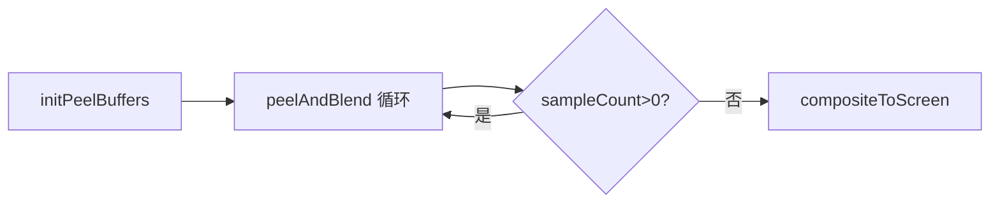

# OpenGL 深度剥离 OIT：关键技术、关键流程详解（问答整合版）

> 项目：**OpenGL_OIT_Depth_Peeling**  
> 本文在第一版博客基础上重写，并整合开发过程中围绕源码提出的核心问题：`peelAndBlend` 全流程、`discard` 与深度测试分工、`glBlendFuncSeparate`、Blend 阶段 GL 状态、`fboPeel_` 颜色/深度角色、`glDepthMask` 在管线中的位置、`waitSampleCount`、层数上限等。  
> 重复内容已合并，以 **「流程 → 机制 → 问答」** 为主线。

---

## 目录

1. [问题背景：为什么需要 OIT](#1-问题背景为什么需要-oit)
2. [本项目一帧在做什么](#2-本项目一帧在做什么)
3. [缓冲架构：fboAccum_ 与 fboPeel_](#3-缓冲架构fboaccum_-与-fbopeel_)
4. [核心函数 peelAndBlend 逐步拆解](#4-核心函数-peelandblend-逐步拆解)
5. [关键机制一：discard 与 GL_LESS 双重筛选](#5-关键机制一discard-与-gl_less-双重筛选)
6. [关键机制二：Blend 阶段的 GL 状态与混合公式](#6-关键机制二blend-阶段的-gl-状态与混合公式)
7. [关键机制三：深度写入与渲染管线阶段](#7-关键机制三深度写入与渲染管线阶段)
8. [waitSampleCount 与层数上限 kMaxDepthPeelLayers](#8-waitsamplecount-与层数上限-kmaxdepthpeellayers)
9. [着色器与 C++ 入口（精简）](#9-着色器与-c-入口精简)
10. [各阶段 OpenGL 状态总表](#10-各阶段-opengl-状态总表)
11. [常见问题速查（问答索引）](#11-常见问题速查问答索引)
12. [调试建议与参考资料](#12-调试建议与参考资料)

---

## 1. 问题背景：为什么需要 OIT

### 1.1 传统 Alpha 混合的排序困境

半透明常用 **Over** 算子（从后往前画）：

\[
C_{final} = C_{src}\cdot\alpha_{src} + C_{dst}\cdot(1-\alpha_{src})
\]

对应 `glBlendFunc(GL_SRC_ALPHA, GL_ONE_MINUS_SRC_ALPHA)`。该运算 **不可交换**：绘制顺序错了，颜色就错。

此外，半透明物体 **不能简单写深度缓冲**，否则后面的层会被错误剔除。因此需要 **OIT（Order-Independent Transparency）**：在多个 Pass 里按正确深度关系处理，**不依赖 `glDraw` 调用顺序**。

### 1.2 深度剥离的思路

沿视线把透明几何切成一层层「深度片」，每 Pass 剥掉 **当前最前且尚未处理** 的一层，再 **从近到远** 累积颜色：

```
视线 ──────────────────────────────►
Pass 0:  [==== L0（最近）====]
Pass 1:       [==== L1 ====]
Pass 2:            [==== L2 ====]
```

本项目实现：**双 FBO 深度乒乓 + Peel 着色器 discard + 硬件 GL_LESS + Front-to-Back Under 混合 + Final 加背景**。

---

## 2. 本项目一帧在做什么

```cpp
void DepthPeelingApp::run() {
  while (!glfwWindowShouldClose(window_)) {
    beginFrame();           // 输入
    initPeelBuffers();      // 清 FBO、重置深度索引、开深度测试
    peelAndBlend();         // ★ 核心：逐层剥离 + 混合
    compositeToScreen();    // 累积色 + 背景 → 屏幕
    endFrame();             // SwapBuffers
  }
}
```



**场景**：Spot 模型 + 三块半透明彩色玻璃（`window-r/g/b.png`）；左右键旋转轨道相机。

**着色器分工**：

| 着色器 | 文件 | 用途 |
|--------|------|------|
| Peel | `depth_peeling_render.*` | 剥离 + Blinn-Phong 光照 |
| Blend | `depth_peeling_blend.*` | 全屏 quad，把当前层混入 accum |
| Final | `depth_peeling_final.*` | accum + 背景色 |
| Init | `depth_peeling_init.*` | 已加载，**帧循环未使用** |

---

## 3. 缓冲架构：fboAccum_ 与 fboPeel_

### 3.1 两个 FBO 的职责

```cpp
GlFramebuffer fboAccum_;  // FBO_0：累积最终透明颜色 + 深度乒乓之一
GlFramebuffer fboPeel_;   // FBO_1：当前剥离层颜色 + 深度乒乓之二
```

每个 FBO 由 `GlFramebuffer` 创建：

- **颜色**：`GL_RGBA16F`（HDR，防多层混合溢出）
- **深度**：`GL_DEPTH_COMPONENT32F`（**可采样**，供 `texture_depth`）

### 3.2 四个附件，两种用途

| 附件 | Peel 阶段 | Blend 阶段 | Final 阶段 |
|------|-----------|------------|------------|
| `fboPeel_.color` | 写本层 RGBA | **被采样**，叠入 accum | — |
| `fboPeel_.depth` | 乒乓写/读剥离深度 | 不参与混合 | — |
| `fboAccum_.color` | — | **写入**累积结果 | **被采样** |
| `fboAccum_.depth` | 乒乓写/读剥离深度 | 仅清深度，不参与公式 | — |

### 3.3 深度乒乓（Ping-Pong）

```cpp
int inputDepthIndex_  = 0;  // 读：texture_depth 来自哪张深度纹理
int outputDepthIndex_ = 1;  // 写：本层深度画到哪张

GLuint depthTexture(int index) const {
  return index ? fboPeel_.depth.id : fboAccum_.depth.id;
}
// 每层结束：
inputDepthIndex_  = (inputDepthIndex_  + 1) % 2;
outputDepthIndex_ = (outputDepthIndex_ + 1) % 2;
```

**为何乒乓？** 同一 Pass 内，深度纹理不能既作 FBO 深度附件被写入，又被片元着色器采样。乒乓是 **读写分离的实现手段**；存的是 **真实剥离深度**，不是装饰。

**颜色与深度的关系（易混点）**：

- **Peel 阶段**：同一 winning 片元 **同时** 写 `fboPeel_.color` 与 output 深度纹理 → **强相关**。
- **Blend 阶段**：只采样 `fboPeel_.color`，**不用** peel 深度 → **无公式关系**。

### 3.4 深度清空值的含义

| 时机 | `glClearDepth` | 作用 |
|------|----------------|------|
| `initPeelBuffers` | `0.0` | 历史深度初值；第一层 `z > 0` 可参与 |
| 每层 Peel 前 | `1.0` | 本层剥离缓冲从「最远」起，`GL_LESS` 竞争最近 |

---

## 4. 核心函数 peelAndBlend 逐步拆解

`peelAndBlend()` 是整帧 OIT 的核心：**循环执行「Peel 一层 → Blend 进 accum → 交换深度索引 → 判断是否继续」**。

### 4.1 循环骨架

```cpp
for (int layer = 0; layer < AppConfig::kMaxDepthPeelLayers; ++layer) {
  // A. 准备 fboPeel_（重绑 output 深度、清空）
  // B. Peel：drawSceneLayer + GL_SAMPLES_PASSED 查询
  // C. waitSampleCount()
  // D. Blend：全屏 quad → fboAccum_
  // E. 乒乓 swap
  // F. sampleCount <= 0 → break
}
```

实际层数 = `min(kMaxDepthPeelLayers, 场景深度复杂度)`，由 `sampleCount` 提前结束。

### 4.2 阶段 A：准备剥离 FBO

```cpp
glBindFramebuffer(GL_FRAMEBUFFER, fboPeel_.fbo);
glFramebufferTexture2D(GL_FRAMEBUFFER, GL_DEPTH_ATTACHMENT, GL_TEXTURE_2D,
                       depthTexture(outputDepthIndex_), 0);
glClearColor(0, 0, 0, 0);
glClearDepth(1.0f);
glClear(GL_COLOR_BUFFER_BIT | GL_DEPTH_BUFFER_BIT);
```

- 深度附件绑到 **写侧** `outputDepthIndex_`。
- **只清 fboPeel_**，不动 `fboAccum_.color` 里已累积的颜色。

### 4.3 阶段 B：Peel Pass

```cpp
glBeginQuery(GL_SAMPLES_PASSED, queryId_);
drawSceneLayer(*shaderPeel_, fboPeel_.fbo, inputDepthIndex_, outputDepthIndex_);
glEndQuery(GL_SAMPLES_PASSED);
```

`drawSceneLayer` 绘制 Spot + 三块玻璃到 `fboPeel_.fbo`，并绑定：

- `texture_diffuse`：模型纹理
- `texture_depth`：`depthTexture(inputDepthIndex_)`（**已剥层深度历史**）

Peel 前 `initPeelBuffers` 已设置：

```cpp
glEnable(GL_DEPTH_TEST);
glDepthFunc(GL_LESS);
glDepthMask(GL_TRUE);
```

### 4.4 阶段 C～F：Blend、swap、退出

见第 6 节（Blend 状态）与第 8 节（`waitSampleCount`）。

### 4.5 前两层数据流（对照调试）

**Layer 0**（`input=0`, `output=1`）：

```
读 depth: fboAccum_.depth (0)
写 depth: fboPeel_.depth
写 color: fboPeel_.color → Blend → fboAccum_.color
```

**Layer 1**（swap 后 `input=1`, `output=0`）：

```
读 depth: fboPeel_.depth（Layer 0 写入）
写 depth: fboAccum_.depth
写 color: fboPeel_.color → Blend → fboAccum_.color
```

---

## 5. 关键机制一：discard 与 GL_LESS 双重筛选

Peel 片元着色器核心：

```glsl
vec2 uv = gl_FragCoord.xy / u_ScreenSize;
float frontDepth = texture(texture_depth, uv).r;
if (gl_FragCoord.z <= frontDepth) {
  discard;  // 已剥过，或深度 ≤ 已记录的前层
}
// ... 光照 ...
FragColor = vec4(litColor, alpha);
```

### 5.1 两层筛选各管什么

| 机制 | 比较对象 | 作用范围 | 解决的问题 |
|------|----------|----------|------------|
| **`discard`** | 当前 z vs **前几 Pass 写入的深度纹理** | **跨 Pass** | 去掉已经剥过的层 |
| **`GL_LESS` + `glDepthMask(TRUE)`** | 当前 z vs **本 Pass 深度缓冲** | **同 Pass、同像素** | 在剩余候选里只留 **最近** 一片 |

记忆：**`discard` 管「第几层」；深度测试管「这一层里谁最近」。**

### 5.2 常见疑问：远的片元先执行，近的会不会被误 discard？

**不会。** `discard` 只和 **历史剥离深度**（`texture_depth`）比，不和「本 Pass 里先执行的片元」比。

同 Pass、同像素示例（`frontDepth=0.3` 来自上一 Pass）：

| 片元 | z | discard | 深度测试 GL_LESS |
|------|---|---------|------------------|
| 远（先执行） | 0.70 | 通过 | 写入 depth=0.70 |
| 近（后执行） | 0.45 | 通过 | 0.45 < 0.70，**替换** |

深度测试在 ROP 阶段 **按像素原子竞争**，与片元 shader 执行顺序无关。若 **关掉深度测试**，才会出现「顺序乱了全错」的问题。

### 5.3 「从前往后」在哪里保证？

- **跨 Pass**：第 0 Pass 剥最近层，第 k Pass 剥「去掉前 k 层后」的最近层。
- **同 Pass**：`GL_LESS` 保证该层每像素只有一个 winner。
- **跨层叠色**：Blend 用 Front-to-Back Under（第 6 节），与 `draw` 顺序无关。

---

## 6. 关键机制二：Blend 阶段的 GL 状态与混合公式

Peel 完成后、全屏 Blend 前：

```cpp
shaderBlend_->use();
glEnable(GL_BLEND);
glDepthMask(GL_FALSE);
glDisable(GL_DEPTH_TEST);
glBlendFuncSeparate(GL_DST_ALPHA, GL_ONE, GL_ZERO, GL_ONE_MINUS_SRC_ALPHA);

modelQuad_->Draw(*shaderBlend_, fboAccum_.fbo,
                {{"texture_diffuse", fboPeel_.color.id}}, {},
                GL_TRIANGLES, {false, true});
// 之后恢复：glDisable(GL_BLEND); glDepthMask(TRUE); glEnable(GL_DEPTH_TEST);
```

### 6.1 五项状态协同

| 设置 | Peel | Blend | 原因 |
|------|------|-------|------|
| `GL_BLEND` | OFF | **ON** | 多层累积，不能覆盖 |
| `GL_DEPTH_TEST` | **ON** + `GL_LESS` | **OFF** | Peel 竞争最近；Blend 全屏必写每像素 |
| `GL_DEPTH_MASK` | **TRUE** | **FALSE** | Peel 写剥离深度；Blend 不写坏乒乓深度 |
| `BlendFuncSeparate` | — | 见下 | Front-to-Back Under |

**`{false, true}`（Draw 参数）**：不清 accum **颜色**，清 accum **深度**（深度历史在乒乓另一侧纹理）。

### 6.2 `glBlendFuncSeparate` 公式

`src` = `fboPeel_.color`，`dst` = `fboAccum_.color`：

| 通道 | 公式 |
|------|------|
| RGB | `C' = C_src × A_dst + C_dst` |
| Alpha | `A' = A_dst × (1 - A_src)` |

初值 `glClearColor(0,0,0,1)` → `C=0, A=1`（尚未被挡）。

叠两层：

```
第1层: C_acc = C₁,           A_acc = 1-α₁
第2层: C_acc = C₂(1-α₁)+C₁,  A_acc = (1-α₁)(1-α₂)
```

即 \(C = C_1 + C_2(1-\alpha_1) + C_3(1-\alpha_1)(1-\alpha_2) + \cdots\)

**Alpha 通道语义**：不是「当前层透明度」，而是 **剩余透射权重**（背后还能透出多少）。

**为何 Separate**：普通 `glBlendFunc` 无法让 RGB 用 `A_dst`、Alpha 用 `1-A_src` 两套因子。

### 6.3 与 Final Pass 的衔接

```glsl
// depth_peeling_final.frag
vec4 frontColor = texture(texture_diffuse, textureCoord);
FragColor = frontColor + vec4(background_color, 1.0) * frontColor.a;
FragColor.a = 1.0;
```

`frontColor.a` 即 Blend 留下的 **未覆盖权重**，用于把背景叠到最远处。

### 6.4 与常见 Over 混合对比

| | Over（画家算法，后→前） | 本项目 Under（前→后） |
|--|-------------------------|------------------------|
| 典型混合 | `GL_SRC_ALPHA, GL_ONE_MINUS_SRC_ALPHA` | `glBlendFuncSeparate(...)` |
| 依赖顺序 | 是 | 否（逐层 Peel 后混合） |

---

## 7. 关键机制三：深度写入与渲染管线阶段

### 7.1 `initPeelBuffers` 中的深度测试三行

```cpp
glEnable(GL_DEPTH_TEST);
glDepthFunc(GL_LESS);
glDepthMask(GL_TRUE);
```

为 Peel 阶段服务；Blend 时临时改为 `DepthMask(FALSE)` + 关深度测试，Blend 结束再恢复。

### 7.2 `glDepthMask(GL_TRUE)` 在流程与管线中的位置

**流程上**：真正写深度发生在 **每一遍 Peel 的 `drawSceneLayer`**，不是 Blend / Final。

**管线上**（片元着色器之后，逐片元操作）：

```
顶点着色器 → 光栅化 → 片元着色器
    → discard?（是则终止）
    → 深度测试 GL_LESS
    → glDepthMask(TRUE)? → 写 gl_FragCoord.z 到深度附件
    → 混合（Peel 时 BLEND 关，直接写颜色）
    → 帧缓冲
```

| 项目 | 说明 |
|------|------|
| 深度值来源 | 光栅化后的 `gl_FragCoord.z`（窗口空间 [0,1]） |
| 谁决定通过 | `glDepthFunc(GL_LESS)` |
| 谁决定写不写 | `glDepthMask`；FALSE 时测试可跑但缓冲不变 |
| discard 与写深度 | `discard` 在 FS 内执行，**不会**进入深度测试，**不会**写深度 |

Peel 时 winning 片元 **同时** 写 `fboPeel_.color` 与 `depthTexture(outputDepthIndex_)`。

---

## 8. waitSampleCount 与层数上限 kMaxDepthPeelLayers

### 8.1 waitSampleCount

```cpp
GLuint DepthPeelingApp::waitSampleCount() {
  GLint available = 0;
  while (!available) {
    glGetQueryObjectiv(queryId_, GL_QUERY_RESULT_AVAILABLE, &available);
  }
  GLuint sampleCount = 0;
  glGetQueryObjectuiv(queryId_, GL_QUERY_RESULT, &sampleCount);
  return sampleCount;
}
```

配合：

```cpp
glBeginQuery(GL_SAMPLES_PASSED, queryId_);
drawSceneLayer(...);
glEndQuery(GL_SAMPLES_PASSED);
if (sampleCount <= 0) break;
```

| 项目 | 说明 |
|------|------|
| 统计什么 | Begin～End 之间 **通过深度测试** 的采样数 |
| 业务含义 | 本层 Peel 是否还有几何参与 → **是否继续剥** |
| 注意 | 与 `discard` 不完全等价；MSAA 下可能有偏差 |
| 实现代价 | `while` 忙等 GPU，教学清晰，生产可改异步查询 |

### 8.2 层数 3 / 10 / 30 的影响

定义于 `AppConfig.hpp`：`constexpr int kMaxDepthPeelLayers = 10;`

```
实际层数 = min(上限, 场景需要层数)，够早停则提前 break
```

| 设为 | 画质 | 性能 |
|------|------|------|
| **3** | 重叠玻璃多时易 **截断**（发暗、缺层） | 最坏情况更省 |
| **10** | 对本 demo 通常够用 | 均衡 |
| **30** | 层数 ≤10 时与 10 **无差别**；>10 时更完整 | 上限高，极端场景更慢 |

**如何判断需要几层**：看控制台 `Samples passed:`，某层变 **0** 即结束。沿视线穿过的透明层数 ≈ 所需下限。

---

## 9. 着色器与 C++ 入口（精简）

### 9.1 Peel 片元（完整逻辑见 `resources/depth_peeling_render.frag`）

- 采样 `texture_depth` + `discard`
- Blinn-Phong 光照（环境/漫反/高光系数 `k.x/y/z`）
- 纹理 alpha 驱动透明度

### 9.2 Blend / Final

- **Blend**：仅 `FragColor = texture(texture_diffuse, uv);`，混合在 C++ 固定管线。
- **Final**：`frontColor + background * frontColor.a`。

### 9.3 入口

```cpp
// main.cpp
DepthPeelingApp app;
if (!app.init()) return -1;
app.run();
app.shutdown();
```

---

## 10. 各阶段 OpenGL 状态总表

| 阶段 | FBO 目标 | BLEND | DEPTH_TEST | DEPTH_MASK | 深度附件读写 |
|------|----------|-------|------------|------------|--------------|
| initPeelBuffers | accum/peel 清屏 | OFF | ON, LESS | TRUE | 清 0 |
| Peel（每层） | fboPeel_ | OFF | ON, LESS | TRUE | 读 input 纹理，写 output 纹理 |
| Blend（每层） | fboAccum_ | ON, Separate | OFF | FALSE | 清 accum 深度 |
| composite | 默认 FB | OFF* | — | — | — |

\* Final 未显式改混合，全屏 quad 直接输出。

---

## 11. 常见问题速查（问答索引）

| 问题 | 结论 |
|------|------|
| `peelAndBlend` 干什么？ | 循环：Peel 一层 → Blend 进 accum → swap 深度 → 无层则停 |
| `discard` 会不会因片元顺序误杀近的？ | 不会；同 Pass 靠 **GL_LESS**，discard 只对 **历史深度纹理** |
| `glBlendFuncSeparate` 那两行？ | Front-to-Back Under；Alpha 存 **剩余透射** |
| 286–290 五项 GL 状态？ | 开混合、关深度测试、不写深度、专用混合公式；一套缺一不可 |
| 200–202 深度测试三行？ | Peel 同像素选最近，并 **写** 深度纹理 |
| `fboPeel_` 深度只为乒乓？ | 乒乓是手段；深度是 **剥离算法数据**；颜色是 **当前层**，accum 才是 **总累积** |
| Peel 颜色与深度关系？ | Peel **同片元同写**；Blend **只用颜色** |
| `glDepthMask(TRUE)` 何时写深度？ | **Peel 绘制**时，管线 **深度测试通过后** 写 `gl_FragCoord.z` |
| `waitSampleCount`？ | 等 GPU 统计本层采样数，为 0 则停止剥离 |
| 层数 3/10/30？ | 上限；改小可能截断画质，改大仅当需要更多层时有意义 |

---

## 12. 调试建议与参考资料

### 12.1 建议实验

1. **RenderDoc**：逐层查看 `fboPeel_.color` 与 `texture_depth`。
2. **`kMaxDepthPeelLayers = 3`**：旋转相机看玻璃重叠区是否穿帮。
3. **注释掉 `discard`**：观察 OIT 完全失效的效果。
4. **看 `Samples passed`**：确认实际剥离层数。

### 12.2 构建与运行

```bash
cmake -B out/build/x64-debug -DCMAKE_BUILD_TYPE=Debug
cmake --build out/build/x64-debug
```

Esc 退出；← / → 旋转相机。

### 12.3 参考

- LearnOpenGL：[Blending](https://learnopengl.com/Advanced-OpenGL/Blending)、[Depth Testing](https://learnopengl.com/Advanced-OpenGL/Depth-testing)
- NVIDIA OIT / Depth Peeling SDK 示例
- McGuire & Bavoil, *Weighted Blended OIT*, JCGT 2013

---

## 附录：单帧逻辑链（一图读懂）

```
initPeelBuffers
  清 accum/peel；depth 清 0；input=0, output=1
  开启 GL_LESS + DepthMask TRUE
        │
        ▼
┌─ peelAndBlend 循环 ─────────────────────────────┐
│  清 fboPeel_（depth 清 1.0，绑 output 深度）      │
│  Peel: discard(历史深度) + GL_LESS(本层最近)      │
│        → fboPeel_.color + output 深度纹理        │
│  waitSampleCount → 0 则跳出                       │
│  Blend: 关深度 + glBlendFuncSeparate → accum     │
│  swap input/output 深度索引                       │
└─────────────────────────────────────────────────┘
        │
        ▼
compositeToScreen: accum + background → 屏幕
```

---

*整合自 OpenGL_OIT_Depth_Peeling 源码及 OIT_MD 目录下问答整理。第一版概述见同目录 `OpenGL深度剥离OIT透明渲染详解.md`。*
