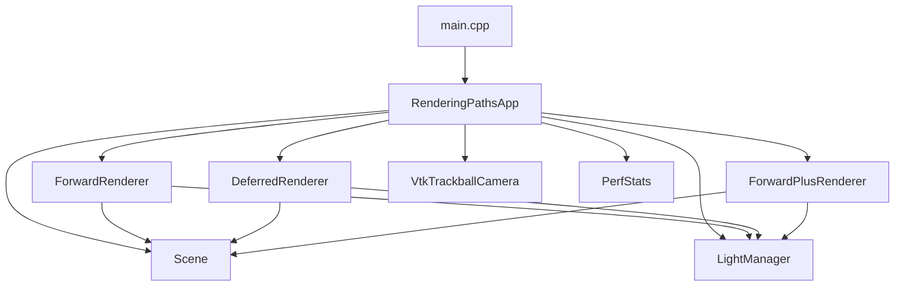
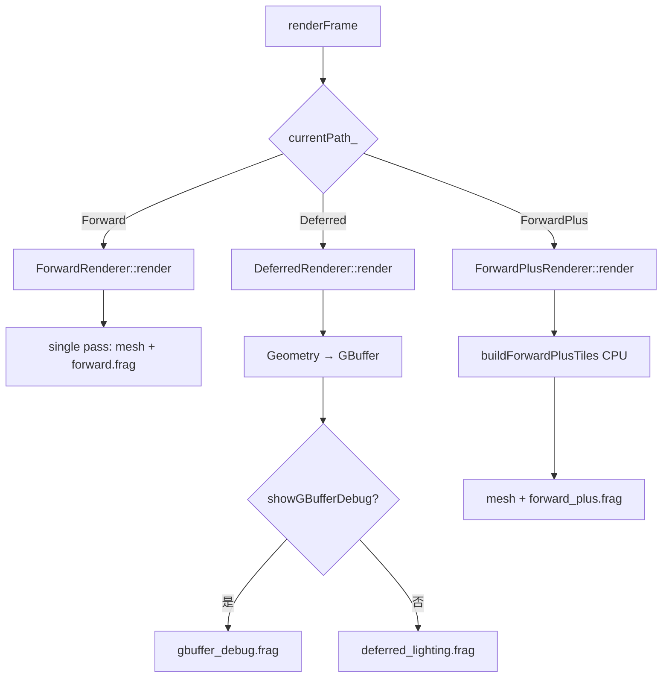

# OpenGL_Rendering_Paths 代码导读

> 本文档面向「对前向 / 延迟 / Forward+ 还不熟悉，但想顺着代码把逻辑走通」的读者。  
> 源码地址：[GitHub 仓库](https://github.com/HalCG/OpenGLInstance/tree/main/OpenGL_Rendering_Paths)  
> **设计、流程、Q&A 与实验备忘：** [`Rendering_Paths_博客.md`](Rendering_Paths_博客.md)  
> 建议：**先读博客或本文第 0～1 节建立概念，再读第 4～5 节看时序，最后按第 10 节顺序打开源码。**

---

## 目录

1. [第 0 节：三种渲染路径从零理解](#0-三种渲染路径从零理解)
2. [第 1 节：这个项目在做什么](#1-这个项目在做什么)
3. [第 2 节：目录与职责一览](#2-目录与职责一览)
4. [第 3 节：架构总图](#3-架构总图)
5. [第 4 节：程序生命周期与时序](#4-程序生命周期与时序)
6. [第 5 节：核心状态变量](#5-核心状态变量)
7. [第 6 节：分模块详解](#6-分模块详解)
8. [第 7 节：三条路径代码对照](#7-三条路径代码对照)
9. [第 8 节：Shader 与数据流](#8-shader-与数据流)
10. [第 9 节：读代码时容易卡住的点](#9-读代码时容易卡住的点)
11. [第 10 节：推荐阅读顺序](#10-推荐阅读顺序)
12. [第 11 节：构建与运行](#11-构建与运行)

---

## 0. 三种渲染路径从零理解

渲染路径（Rendering Path）回答的是：**给定 N 个物体、M 盏灯，GPU 按什么顺序算颜色？**

下面用「一个像素要被多少盏灯影响」来建立直觉。本 Demo 默认 **12 个 spot 实例 + 地板 + 256 盏点光源**。

### 0.1 前向渲染（Forward）

**一句话：** 画每个物体时，**在这个物体的 fragment shader 里，对该像素循环所有光源**。

```
对每个 mesh 实例：
  对每个 fragment（像素）：
    color = 环境光
    for 每一盏点光源：
      color += 这盏光对该像素的贡献
    写入 framebuffer
```

| 优点 | 缺点 |
|------|------|
| 思路简单，透明物体自然支持 | 光源多时 **fragment 循环爆炸** |
| MSAA 友好 | 复杂度 ≈ **物体数 × 像素数 × 光源数**（本 Demo 最重） |

**本项目对应：** `ForwardRenderer` + `forward.frag`（`for (i = 0; i < uLightCount; ++i)`）。

---

### 0.2 延迟渲染（Deferred）

**一句话：** 先 **不写最终颜色**，把每个像素的几何属性存进 **G-Buffer**；再 **全屏** 按像素读 G-Buffer，循环光源算光照。

分两趟（Pass）：

```
Pass 1 — Geometry（几何 Pass）
  对每个 mesh：
    只写 G-Buffer：albedo、法线、材质系数、depth
    （不算光）

Pass 2 — Lighting（光照 Pass）
  全屏 quad，每个屏幕像素：
    从 G-Buffer 读出 albedo/normal/depth
    重建世界坐标
    for 每一盏点光源：
      color += 这盏光的贡献
    写入屏幕
```

| 优点 | 缺点 |
|------|------|
| 光照复杂度 ≈ **屏幕像素 × 光源数**，与物体数量解耦 | G-Buffer 占带宽；MSAA 难做 |
| 多光源、多材质时 often 更稳 | **透明物体** 不能直接进 G-Buffer（需 hybrid / OIT） |

**本项目对应：** `DeferredRenderer` → `geometry.frag` 写 MRT，`deferred_lighting.frag` 全屏打光。

---

### 0.3 前向增强 / Forward+（Tiled Forward）

**一句话：** 仍是 **前向**（画 mesh 时在 fragment 里算光），但 **每像素只循环「可能照到它的那几盏灯」**，而不是全部 256 盏。

实现分两步：

```
Pass 0 — CPU Tile Culling（本 Demo 在 CPU 做）
  把屏幕划成 16×16 的 tile
  对每盏灯：算它在屏幕上盖住哪些 tile
  每个 tile 维护一份「候选光源 index 列表」（最多 64 盏）

Pass 1 — Forward Shading
  对每个 mesh fragment：
    根据 gl_FragCoord 算自己属于哪个 tile
    只循环该 tile 列表里的光源（通常远少于 256）
```

| 优点 | 缺点 |
|------|------|
| 保留前向的透明/MSAA 友好 | 需要 **tile 剔除** 阶段（CPU 或 Compute） |
| 多光源下比纯 Forward 快很多 | tile 过大仍可能塞满 64 盏上限 |

**本项目对应：** `LightManager::buildForwardPlusTiles` + `ForwardPlusRenderer` + `forward_plus.frag`。

---

### 0.4 三者关系（一张表）

| | Forward | Deferred | Forward+ |
|--|---------|----------|----------|
| 何时算光 | 画物体时 | 全屏后处理 | 画物体时 |
| 光源循环在哪 | `forward.frag` | `deferred_lighting.frag` | `forward_plus.frag` |
| 几何 Pass 次数 | 1 | 2（Geometry + Lighting） | 2（Cull + Shading） |
| 本 Demo 瓶颈（256 光） | `forward_ms` 很高 | `light_ms` 较高，`geom_ms` 较稳 | `shade_ms` 中等，`cull_ms` 较小 |

---

## 1. 这个项目在做什么

这是一个 **三种光照渲染路径对比 Demo**，在 **同一场景、同一套点光源数据** 下，运行时切换：

| 路径 | 按键 | 核心思路 |
|------|------|----------|
| Forward | `1` / `F1` | 单 Pass，fragment 循环全部 SSBO 光源 |
| Deferred | `2` / `F2` | Geometry → G-Buffer；Lighting 全屏打光 |
| Forward+ | `3` / `F3` | CPU tile 剔除 → fragment 只循环 tile 内光源 |

**设计原则：**

1. **场景与光源统一**：`Scene` + `LightManager` 三条路径共用，对比的是 **算法** 而非不同关卡。
2. **运行时切换**：`currentPath_` 在 `renderFrame()` 里 `switch` 到三个 `*Renderer`。
3. **可观测**：`PerfStats` 分别计时 `forward_ms` / `geom_ms`+`light_ms` / `cull_ms`+`shade_ms`。
4. **事件驱动主循环**：静止时 `glfwWaitEvents`；有输入时 `poll + render + swap`（与 Anti_Aliasing Demo 类似，但 **无** TAA 式持续出帧）。

**对比实验建议：** 固定 256 盏光，依次按 `1`→`2`→`3`，看窗口标题与各 pass 毫秒数；再按 `[` 把光源降到 64，观察 Forward 是否明显变快。

---

## 2. 目录与职责一览

```
OpenGL_Rendering_Paths/
├── main.cpp                      # init → run → shutdown
├── include/
│   ├── RenderingPathsApp.hpp     # 总控：路径切换、主循环、输入
│   ├── AppConfig.hpp             # 窗口、tile 大小、光源 preset、资源路径
│   ├── RenderTypes.hpp           # RenderPath、GpuPointLight、FrameStats
│   ├── Scene.hpp                 # spot 网格实例 + 地板
│   ├── LightManager.hpp          # SSBO 光源 + Forward+ tile 剔除
│   ├── ForwardRenderer.hpp
│   ├── DeferredRenderer.hpp      # G-Buffer FBO + geometry/lighting/debug
│   ├── ForwardPlusRenderer.hpp
│   ├── PerfStats.hpp             # 各 pass GPU 计时
│   ├── VtkTrackballCamera.hpp    # 轨道球相机
│   └── Shader.hpp / Mesh.hpp / Model.hpp
├── src/
└── resources/
    ├── shaders/
    │   ├── mesh.vert             # 三条路径几何 Pass 共用
    │   ├── forward.frag
    │   ├── geometry.frag         # Deferred Geometry → MRT
    │   ├── deferred_lighting.frag
    │   ├── forward_plus.frag
    │   ├── gbuffer_debug.frag
    │   └── fullscreen.vert       # Deferred 全屏 Pass
    └── models/spot/
```

**运行时资源：** 构建后 `OpenGL_Rendering_Paths/resources/` 复制到 exe 旁 `resources/`；`AppConfig::shaderPath(...)` 解析为 `resources/shaders/...`。

---

## 3. 架构总图

### 3.1 模块依赖



### 3.2 一帧分发（`renderFrame`）



**关键：** 只有 `currentPath_` 决定走哪条管线；`Scene::draw*` 与 `LightManager` 被三条路径 **复用**。

---

## 4. 程序生命周期与时序

### 4.1 启动链（`main` → `init`）

```
main()
  └─ RenderingPathsApp::init()
       ├─ initWindow()           GLFW + GLAD + 回调
       ├─ scene_.init()          12×spot + floor
       ├─ lights_.init()         SSBO + regenerate(256)
       ├─ perf_*Pass.init()     五个 GpuTimer
       ├─ forward_/deferred_/forwardPlus_.init()
       └─ deferred_.resize()    创建 G-Buffer FBO
```

**阅读位置：** `RenderingPathsApp.cpp` 第 27～52 行。

### 4.2 主循环（`run`）

```cpp
while (!glfwWindowShouldClose) {
    active = cameraDirty_ || camera_.isDragging();
    if (active)  glfwPollEvents();
    else         glfwWaitEvents();

    if (cameraDirty_) {
        renderFrame();
        glfwSwapBuffers();
        cameraDirty_ = false;
    }
}
```

| 机制 | 作用 |
|------|------|
| `cameraDirty_` | 输入 / resize / 切路径 / 改光源数后触发一帧 |
| `isDragging()` 时仍 poll | 拖拽中持续收鼠标，避免卡住 |
| 先 poll 再 render | 减少相机 1 帧延迟 |

**与 Anti_Aliasing Demo 区别：** 本 Demo **没有** `continuousRender`；静止画面不会每帧重绘。

**阅读位置：** `RenderingPathsApp.cpp` 第 137～161 行。

### 4.3 单帧内部（`renderFrame`）

| 步骤 | 做什么 |
|------|--------|
| 1 | 拖拽时关闭 GPU timer |
| 2 | `perf_.beginFrame()` |
| 3 | `buildCamera()` → view / projection / eye |
| 4 | `switch (currentPath_)` 调用对应 renderer |
| 5 | `perf_.endFrame()` → FPS / totalFrameMs |
| 6 | 每 15 帧更新窗口标题（拖拽时跳过） |

**阅读位置：** `RenderingPathsApp.cpp` 第 101～135 行。

### 4.4 输入与状态切换

| 按键 | 效果 |
|------|------|
| `1`～`3` | 切换 `currentPath_`；离开 Deferred 时清 `showGBufferDebug_` |
| `[` / `]` | 切换光源 preset：64 / 128 / 256 / 512 → `lights_.regenerate` |
| `G` | 仅 Deferred：切换 G-Buffer 调试全屏视图 |
| 鼠标 | VTK 轨道球 → `markCameraDirty()` |

**阅读位置：** `keyCallback` 第 277～328 行；resize → `deferred_.resize` 第 216～227 行。

---

## 5. 核心状态变量

读懂 `RenderingPathsApp.hpp`：

| 变量 | 含义 |
|------|------|
| `currentPath_` | **主开关**：Forward / Deferred / Forward+ |
| `showGBufferDebug_` | Deferred 下是否跳过 lighting，只看 G-Buffer |
| `camera_` / `cameraDirty_` | 轨道球 + 是否需渲染 |
| `lightPresetIndex_` | `[` `]` 对应 64～512 光源 |
| `scene_` | 12 spot + floor |
| `lights_` | 点光源 SSBO + Forward+ tile 缓冲 |
| `forward_` / `deferred_` / `forwardPlus_` | 三条 renderer |
| `perf_` | 各 pass 毫秒数 |

`RenderPath` 定义见 `RenderTypes.hpp`；`GpuPointLight` 与 shader 里 `PointLight` 结构 **内存布局一致**（两个 `vec4`）。

---

## 6. 分模块详解

### 6.1 `RenderingPathsApp` — 总控

职责：窗口、输入、**按路径分发** `renderFrame`、标题栏性能文案。

`buildCamera()` 只做标准 perspective × orbit view，**无** TAA jitter。

`buildOverlayText()` 按路径显示不同 pass 耗时字段（第 190～207 行）。

---

### 6.2 `Scene` — 公平对比用的场景

| 元素 | 配置 | 作用 |
|------|------|------|
| 12× spot | `kSpotInstanceCount`，网格排列 | 多 draw call，放大 Forward 与几何 Pass 差异 |
| 地板 | 16×16 四边形，白纹理 | 简单大面积几何 |
| 共享 mesh | 同一 `spot.obj` + `spot.png` | 三条路径 draw 相同实例 |

`drawFloor` / `drawSpotMeshes` 接收 `Shader&`，由 **当前路径的 renderer** 绑定 program 后调用。

**阅读位置：** `Scene.cpp` 第 95～136 行。

---

### 6.3 `LightManager` — 光源 SSBO 与 Forward+ 剔除

#### 数据结构

```cpp
struct GpuPointLight {
    glm::vec4 positionRadius;   // xyz 位置, w 影响半径
    glm::vec4 colorIntensity;   // rgb 颜色, w 强度
};
```

- `lightBuffer_`：全部光源（最多 512），binding = 0，三条路径 lighting 都读它。
- `regenerate(n)`：固定种子 RNG，保证 **切路径时光源位置不变**（公平对比）。

#### `uploadToGpu()`

每帧 `glBufferSubData` 把 `lights_` 写入 SSBO（Forward / Deferred lighting / Forward+ shading 前都会调）。

#### `buildForwardPlusTiles()` — Forward+ 核心（CPU）

**目的：** 对每个屏幕 tile（16×16 像素），记录 **可能影响的点光源 index 列表**。

算法概要（第 68～149 行）：

1. 算 `tilesX_` × `tilesY_`。
2. 对每盏活跃光源：
   - 用 **半径** 构造 8 个 AABB 角点；
   - 乘 `viewProj` 投到屏幕，得像素矩形 `[minX,maxX]×[minY,maxY]`；
   - 映射到 tile 范围 `[tileMinX,tileMaxX]×[tileMinY,tileMaxY]`；
   - 对每个覆盖的 tile：`tileCount[tile]++`，`tileIndex[tile][count] = lightIndex`（上限 `kMaxLightsPerTile=64`）。
3. 上传 `tileCountBuffer_`（binding 1）、`tileIndexBuffer_`（binding 2）。

**注意：** 这是 **保守** 包围：tile 内像素未必都被该灯照到，但绝不会漏掉该照到的灯（在 AABB 近似正确的前提下）。

---

### 6.4 `ForwardRenderer` — 经典前向

**流程（单 Pass）：**

```
clear → upload lights → bind SSBO 0
→ forward.frag: uLightCount = activeCount
→ drawFloor + drawSpotMeshes（每个 fragment 循环全部光源）
```

**阅读位置：** `ForwardRenderer.cpp` 全文；shader `forward.frag` 第 30～47 行 `for` 循环。

**性能特征：** `uLightCount` 从 64 增到 512 时，`forward_ms` 近似线性上升。

---

### 6.5 `DeferredRenderer` — 两 Pass + G-Buffer

#### G-Buffer 布局（`createGBuffer`）

| 附件 | 格式 | Shader 输出 | 内容 |
|------|------|-------------|------|
| RT0 | RGBA8 | `gAlbedo` | 漫反射采样 |
| RT1 | RGB16F | `gNormal` | 世界法线 |
| RT2 | RGBA8 | `gMaterial` | ka,kd,ks（本 Demo 写常量 0.15,0.75,0.35） |
| Depth | D32F | 深度缓冲 | 重建世界坐标用 |

`glDrawBuffers(3, ...)` 声明 MRT 写三个 color attachment。

#### Pass 1 — Geometry

```
bind gBufferFbo_ → clear → geometryShader + mesh.vert/geometry.frag
→ scene.drawFloor + drawSpotMeshes
→ unbind
```

`geometry.frag` **不算光**，只写 G-Buffer。

#### Pass 2 — Lighting（或 Debug）

- **正常：** `deferred_lighting.frag` 全屏 quad，读 4 张纹理 + SSBO，每像素循环全部光源。
- **Debug（G 键）：** `gbuffer_debug.frag` 直接可视化 albedo/normal/material，**跳过** lighting timer。

Lighting Pass 内 `reconstructWorldPos`：uv + depth → clip → invProjection → invView → 世界坐标（与 TAA 重投影同类思路，见 Anti_Aliasing 博客 Q8）。

**阅读位置：** `DeferredRenderer.cpp` 第 134～204 行。

---

### 6.6 `ForwardPlusRenderer` — 两阶段前向

```
1. cullPass:  lights.buildForwardPlusTiles(w, h, camera)
2. shadingPass:
     upload lights + bind SSBO 0/1/2
     forward_plus.frag
     drawFloor + drawSpotMeshes
```

Fragment 内（`forward_plus.frag`）：

```glsl
ivec2 tile = ivec2(gl_FragCoord.xy) / uTileSize;
int tileIndex = tile.y * uTilesX + tile.x;
for (i = 0; i < counts[tileIndex]; ++i)
    lightIndex = indices[tileIndex * uMaxLightsPerTile + i];
    // 只对 lightIndex 这盏光做 Blinn-Phong
```

**阅读位置：** `ForwardPlusRenderer.cpp`；`forward_plus.frag` 第 35～68 行。

---

### 6.7 `PerfStats` — 各路径该看哪个字段

| 路径 | GpuTimer | 写入字段 | 含义 |
|------|----------|----------|------|
| Forward | `forwardPass` | `forwardPassMs` | 整段前向 Pass |
| Deferred | `geometryPass` / `lightingPass` | `geometryPassMs` / `lightingPassMs` | 几何 / 光照 |
| Forward+ | `cullPass` / `shadingPass` | `cullPassMs` / `shadingPassMs` | CPU tile / GPU 着色 |

`totalFrameMs` / `fps` 仍是 CPU 墙钟（`beginFrame`/`endFrame`），与 Anti_Aliasing Demo 相同。

拖拽时 `setEnabled(false)` 避免 query stall。

---

## 7. 三条路径代码对照

### Forward

```
renderFrame → ForwardRenderer::render
  → forward.frag 内 for 全部 uLightCount 盏光
```

文件：`ForwardRenderer.cpp`，`resources/shaders/forward.frag`。

### Deferred

```
renderFrame → DeferredRenderer::render
  → Geometry: geometry.frag → GBuffer
  → Lighting: deferred_lighting.frag（或 G → gbuffer_debug.frag）
```

文件：`DeferredRenderer.cpp`，`geometry.frag`，`deferred_lighting.frag`。

### Forward+

```
renderFrame → ForwardPlusRenderer::render
  → LightManager::buildForwardPlusTiles  (CPU)
  → forward_plus.frag 内 for tile 内 localCount 盏光
```

文件：`ForwardPlusRenderer.cpp`，`LightManager.cpp`，`forward_plus.frag`。

---

## 8. Shader 与数据流

### 8.1 共用顶点阶段

`mesh.vert`：输入 position/normal/uv → 输出 `vWorldPos`、`vNormal`、`vTexCoord`；三条路径的几何绘制 **共用**（Deferred Geometry 与 Forward/Forward+ Shading 都用）。

### 8.2 SSBO 布局（binding 0）

三条 fragment shader 中结构一致：

```glsl
layout(std430, binding = 0) readonly buffer LightBuffer {
    PointLight lights[];
};
```

C++ 侧 `glBindBufferBase(GL_SHADER_STORAGE_BUFFER, 0, lights.lightBuffer())`。

### 8.3 Forward+ 额外 SSBO

| Binding | 缓冲 | 内容 |
|---------|------|------|
| 1 | `tileCountBuffer_` | 每 tile 光源数量 |
| 2 | `tileIndexBuffer_` | 每 tile 最多 64 个 light index |

### 8.4 光照模型（三者相同）

Blinn-Phong 风格简化：

- `uMaterialK.x/y/z` → ambient / diffuse / specular 系数
- 点光源半径衰减：`smoothstep(radius*0.7, radius, dist)`
- 无阴影、无 HDR tone mapping（LDR Demo）

---

## 9. 读代码时容易卡住的点

### Q1. Forward 和 Forward+ 的 shader 看起来很像，差在哪？

| | `forward.frag` | `forward_plus.frag` |
|--|----------------|---------------------|
| 光源循环上界 | `uLightCount`（256） | `counts[tileIndex]`（通常 ≪ 256） |
| 光源 index | `i` 直接访问 `lights[i]` | `indices[...]` 间接访问 |
| 额外 uniform | 无 | `uTilesX/Y`, `uTileSize`, `uMaxLightsPerTile` |

### Q2. Deferred 为什么要 `uInvView` 和 `uInvProjection`？

Lighting Pass 只有 **屏幕 uv + depth**，没有 `vWorldPos`。  
`deferred_lighting.frag` 的 `reconstructWorldPos` 把像素还原到世界空间，才能算 `lightDir = lightPos - worldPos`。

### Q3. `showGBufferDebug_` 有什么用？

学习用：按 `G` 直接看 Geometry Pass 写入的 albedo/normal/material，确认 **Pass 1 是否正确**，而不被 Pass 2 光照干扰。

### Q4. 为什么 Forward 拖拽最卡？

256 盏光 × 12 实例 × 每像素循环，fragment 负载最重；Forward+ 通过 tile 把循环长度压短。这是 **算法特性**，不一定是 bug。可 `[` 降光源或按 `3` 切 Forward+ 对比。

### Q5. tile 里光源超过 64 盏会怎样？

`buildForwardPlusTiles` 里 `count >= kMaxLightsPerTile` 时 **丢弃** 多余光源（该 tile 可能偏暗）。调大 `AppConfig::kMaxLightsPerTile` 或减小 `kTileSize` 可缓解。

### Q6. Deferred 能处理透明吗？

**本 Demo 不能。** 透明需单独 forward pass 或 OIT 子项目（Linked List / Depth Peeling 等）。见学习笔记「与 OIT 子项目的关系」。

### Q7. `TextOverlay` 有用吗？

与 Anti_Aliasing 一样，**未接入主流程**；性能信息走 **窗口标题**。

---

## 10. 推荐阅读顺序

| 顺序 | 文件 | 关注什么 |
|------|------|----------|
| ① | 本文 **§0** | 三种路径概念 |
| ② | `include/RenderTypes.hpp` | `RenderPath`、`GpuPointLight` |
| ③ | `include/RenderingPathsApp.hpp` | 成员变量地图 |
| ④ | `RenderingPathsApp.cpp` → `run` / `renderFrame` | 分发逻辑 |
| ⑤ | `Scene.cpp` | 场景里有什么 |
| ⑥ | `LightManager.cpp` | SSBO + `buildForwardPlusTiles` |
| ⑦ | **Forward 路径** | `ForwardRenderer.cpp` + `forward.frag` |
| ⑧ | **Deferred 路径** | `DeferredRenderer.cpp` + `geometry.frag` + `deferred_lighting.frag` |
| ⑨ | **Forward+ 路径** | `ForwardPlusRenderer.cpp` + `forward_plus.frag` |
| ⑩ | `PerfStats.cpp` | 计时从哪来 |

**第一次精读建议：**

1. 先跟通 **Forward**（最简单：一个 Pass、一个 `for`）。
2. 再 **Deferred**：对照 G-Buffer 附件读 Geometry，再读全屏 lighting。
3. 最后 **Forward+**：先读 `buildForwardPlusTiles`，再对照 `forward_plus.frag` 里 tile index 怎么用。

跑 Demo 时开控制台 CSV（每 120 帧），记录 `forward_ms` / `geom_ms`+`light_ms` / `cull_ms`+`shade_ms`。

---

## 11. 构建与运行

仓库：[https://github.com/HalCG/OpenGLInstance](https://github.com/HalCG/OpenGLInstance)

```bash
git clone https://github.com/HalCG/OpenGLInstance.git
cd OpenGLInstance
cmake --preset x64-clang-debug
cmake --build out/build/x64-clang-debug --target OpenGL_Rendering_Paths
```

可执行文件：`out/build/x64-clang-debug/OpenGL_Rendering_Paths/OpenGL_Rendering_Paths.exe`  
资源：`OpenGL_Rendering_Paths/resources/` → exe 旁 `resources/`。

| 按键 | 功能 |
|------|------|
| `1`～`3` / `F1`～`F3` | Forward / Deferred / Forward+ |
| `[` `]` | 光源 64 / 128 / 256 / 512 |
| `G` | Deferred：G-Buffer 调试视图 |
| LMB / MMB / RMB | 旋转 / 平移 / 缩放 |
| `ESC` | 退出 |

---

## 12. 与其它文档的分工

| 文档 | 内容 |
|------|------|
| **本文（代码导读）** | 零基础概念、架构、时序、模块、Shader 数据流、阅读路线 |
| **Rendering_Paths_博客.md** | 设计流程、Q&A、对比表、预期现象、常见坑、扩展方向、OIT 关联 |

建议：**本文建立地图并跟代码 → 博客做原理备忘与实验记录 → 需要改参数时回 `AppConfig.hpp` 与对应 `.frag`**。

---

*文档版本：与 `OpenGL_Rendering_Paths` 源码同步（resources 位于项目目录 `OpenGL_Rendering_Paths/resources/`）。*
